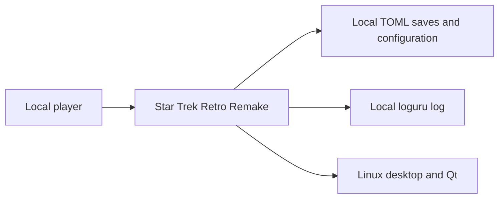
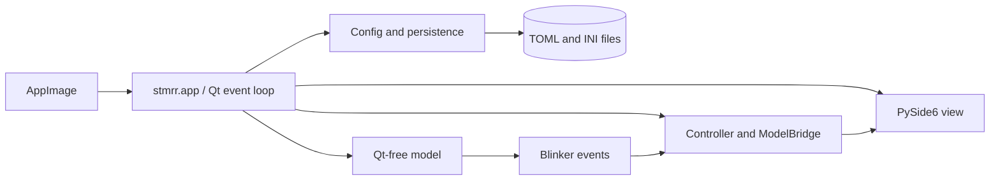
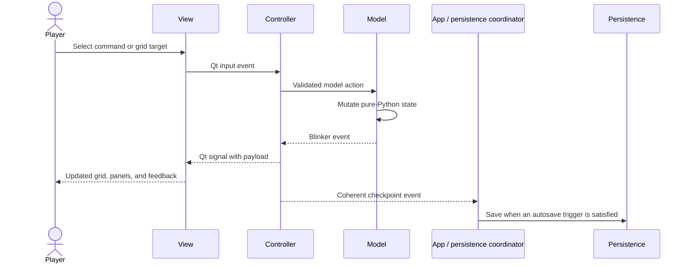

# Star Trek Retro Remake Through v1.0.0 — Specification (Standard)

## Revision History

| Version | Date | Author | Change |
| --- | --- | --- | --- |
| 0.1 | 2026-07-26 | Codex | Initial master specification synthesized from the canonical design, accepted ADRs, completed milestone specifications, and current implementation evidence. |
| 0.2 | 2026-07-26 | Codex | Resolved Codex review CR-001 through CR-008: completed canonical feature ownership, split oversized milestones, assigned evolving configuration/persistence, completed traceability, corrected orchestration and adjacent architecture, exposed future persistence decisions, and normalized ADR metadata. |
| 0.3 | 2026-07-26 | Codex | Resolved Opus round-one SA-001 through SA-014: bound tracked promotion, added campaign entry and terminal-state ownership, made balance normative, and completed performance, licensing, geometry, workflow, and data-policy contracts. |
| 0.4 | 2026-07-26 | Codex | Promoted the Codex-ready and Opus-converged normative content to the tracked Project Spec corpus; adjusted only lifecycle, status, and location-relative links. |

**Spec lifecycle:** This tracked document is `approved` and change-controlled. Changes to scope,
requirements, architecture, release gates, or milestone boundaries require a revision row and
renewed owner approval. Implementation deviations belong in the
[Deviations Log](#deviations-log), not in silent requirement edits.

---

## 1. Purpose & Background

Star Trek Retro Remake is an unofficial, non-commercial, Linux desktop strategy game that
reimagines the 1971 _Star Trek_ and 1973 _Super Star Trek_ games as a deliberate,
information-dense, mid-1990s-style graphical application. The player acts as a Starfleet
captain: exploring a generated galaxy, managing a ship and crew, completing missions, and
resolving tactical combat on an isometric sector grid.

The canonical game design defines the complete product vision, but it does not by itself give
implementers a compact chronological contract from the current scaffold through v1.0.0.
Earlier work therefore accumulated milestone-level specifications for v0.1 Steps 3 through 10.
This master specification supplies the missing release-wide authority: it states the product
boundary, preserves the accepted architecture, defines release-blocking outcomes, and
decomposes the remaining work into bounded sub-specifications.

Successful completion produces a playable, distributable v1.0.0 game with the full roadmap
capabilities from v0.1 through v1.0, while preserving the Qt-free simulation model and the
single audited model-event-to-Qt seam. The chronological decomposition is intentionally
incremental: each sub-spec must be independently reviewable, implementable, and verifiable,
and no later release may begin until the prior release gate passes.

## 2. Scope

### 2.1 In Scope

- A Linux-only, single-player, turn-based strategy game through the v1.0.0 release.
- Galaxy, sector, and combat gameplay modes, with combat occurring on the active sector grid.
- An isometric Qt graphics view with bounded zoom, pan, z-level presentation, entity rendering,
  selection, movement, and action feedback.
- Starship combat, AI, missions, resource management, mutable faction relations, hailing,
  diplomacy, economy/trading, starbase services, reputation, difficulty modes, procedural
  galaxy generation, captain and crew progression, and ship upgrades.
- Human-inspectable TOML configuration and save data validated through pydantic models.
- Hybrid autosave, five manual slots, and one rolling autosave slot.
- Retro visual theming, generated visual assets with prompt provenance, licensed/attributed
  bundled assets, a full audio pass at v1.0, and AppImage distribution.
- A chronological sub-specification catalog from the completed scaffold through v1.0.0.
- Automated acceptance through the repository verification gate plus milestone-specific
  behavior, rendering, round-trip, and packaging checks.

### 2.2 Out of Scope (Non-Goals — never)

| ID | Non-Goal | Reason |
| --- | --- | --- |
| NG-001 | Support Windows or macOS. | ADR-0002 establishes Linux as the only supported platform. |
| NG-002 | Add multiplayer, online accounts, telemetry, cloud saves, or hosted services. | The product is a local, single-player desktop game and no approved design introduces network operation. |
| NG-003 | Use pygame, SDL embedding, or a second event loop for rendering. | ADR-0001 selects pure Qt rendering and one Qt event loop. |
| NG-004 | Serialize game state with `pickle` or `dill`. | ADR-0004 requires inspectable TOML and rejects executable deserialization formats. |
| NG-005 | Add a separate combat map or combat scene. | ADR-0008 requires positional continuity on the existing sector grid. |
| NG-006 | Commercialize the project or copy official Star Trek media assets. | The project is a non-commercial fan work with an explicit intellectual-property boundary. |
| NG-007 | Add cutscenes or a heavily scripted campaign for v1.0.0. | The approved design uses mission briefings, static dialogs, and emergent play. |

### 2.3 Won't Have in v1 (deferred — not never)

| ID | Deferred Capability | Why Deferred | Revisit When |
| --- | --- | --- | --- |
| WH-001 | Localization beyond English. | The initial release is single-locale and no translation workflow exists. | A maintained translation workflow and at least one committed translation are owner-approved. |
| WH-002 | Away-team and shuttle gameplay. | These systems do not support the captain-chair core loop required for v1.0.0. | A post-v1 roadmap defines their domain model and interaction with missions. |
| WH-003 | Heavy narrative campaigns and branching story arcs. | v1.0 emphasizes systems, missions, and emergent events. | The six mission types and procedural content prove stable enough to support authored campaigns. |
| WH-004 | Cross-platform packaging. | Linux-only is an accepted product constraint. | ADR-0002 is superseded by a tested platform-support decision. |
| WH-005 | Threaded simulation or AI execution. | Turn-based workloads and modest entity counts do not require concurrency. | Measured synchronous AI work exceeds the approved interaction budget on supported hardware. |

### 2.4 Boundaries

| Boundary | Description |
| --- | --- |
| System owns | Local simulation state, UI behavior, TOML configuration and saves, generated game content, packaged assets, logs, and the AppImage artifact. |
| System depends on | Python 3.14+, PySide6/Qt, declared runtime libraries, a supported Linux desktop, and user-provided local filesystem space. |
| System does not own | Qt or Linux distribution behavior, Star Trek intellectual property, external image-generation services, player backup policy outside built-in save slots, or post-v1 features. |

## 3. Context

### 3.1 Current State

v0.1 scaffold Steps 1 through 10 are implemented on `main`. The repository has a runnable
`python -m stmrr` shell, a Qt-free model foundation, isometric projection, a model-state
manager, the Blinker-to-Qt `ModelBridge`, a `QMainWindow`, and strict automated gates. The
central window still contains a placeholder; no graphics scene renders the sector grid.

Existing milestone specifications cover the model umbrella and Steps 3 through 10. The
canonical product design is `docs/design/DESIGN.md`; accepted ADRs own hard-to-reverse
decisions when a design paragraph conflicts with an ADR. The next chronological milestone is
Step 11: `MapView` and `GridScene`.

### 3.2 Target State

At v1.0.0, a player can start or load a local game, navigate a procedurally generated galaxy,
enter sectors, explore and fight on a z-aware isometric grid, complete missions, hail and
negotiate with factions, trade and use starbase services, manage resources, progress a captain
and crew, upgrade a ship, hear the finished audio presentation, and run the game from an
AppImage. All release gates pass on the supported Linux baseline, and the project documentation
describes the shipped behavior.

### 3.3 Assumptions

| ID | Assumption | Impact if False |
| --- | --- | --- |
| A-001 | The canonical game design and accepted ADRs represent owner-approved product decisions through v1.0.0. | A contradicted release or subsystem must pause while the owner resolves the source of truth. |
| A-002 | A solo-developer, direct-to-`main` workflow remains approved. | Milestone integration and release procedures must be revised before the next protected-branch change. |
| A-003 | Turn-based entity counts remain within the design's modest sector and graphics-item bounds. | Performance requirements and possibly the synchronous architecture require a reviewed revision. |
| A-004 | The declared PySide6 and runtime dependency floors remain available for Python 3.14 on supported Linux systems. | Packaging and runtime compatibility need a dependency decision before the affected release gate. |

### 3.4 Constraints

| ID | Constraint | Source |
| --- | --- | --- |
| C-001 | The model layer shall contain no Qt or shiboken imports. | ADR-0003 and import-linter. |
| C-002 | `controller/model_bridge.py` shall remain the only module that imports model events and Qt together. | Canonical MVC architecture and import-linter. |
| C-003 | Rendering shall use PySide6 `QGraphicsView`/`QGraphicsScene` under one Qt event loop. | ADR-0001. |
| C-004 | Combat shall reuse the current sector scene, positions, grid, z-levels, and projection. | ADR-0008. |
| C-005 | Configuration and saves shall use TOML validated through pydantic; executable object serialization is forbidden. | ADR-0004. |
| C-006 | The galaxy shall be procedurally generated from a seed by v1.0.0. | ADR-0006. |
| C-007 | Captain progression shall remain uncapped; level 100 is a design target, not a hard cap. | ADR-0007. |
| C-008 | v0.1 shall remain silent; audio implementation belongs to v1.0 polish. | ADR-0009. |
| C-009 | Visual assets shall be original generated work with archived prompts; QtAwesome supplies UI glyphs. | ADR-0012 and the project IP convention. |
| C-010 | Python and Markdown changes shall pass the repository-selected Project Standards gates. | `.standards/config.toml` and `AGENTS.md`. |
| C-011 | Sector gameplay supports width/height 1–20 and depth 1–7; `MAX_Z_DEPTH = 10` is painter-order headroom, not a ten-level gameplay bound. | Canonical design §4.3 and `SPEC-S004`. |

## 4. Goals

| ID | Goal | Success Signal | Achieved By |
| --- | --- | --- | --- |
| G-001 | Deliver a playable vertical slice before deep feature work. | The complete v0.1 Definition of Done passes. | FR-001, FR-002 |
| G-002 | Deliver tactical combat and durable campaign foundations. | v0.2 combat, AI, mission foundation, campaign entry, and save/load acceptance pass. | FR-003, FR-004, FR-017 |
| G-003 | Deliver the resource, mission, faction, and economy metagame. | v0.3 resources, missions, reputation, faction interactions, trading, services, and difficulty acceptance pass. | FR-005 through FR-007 |
| G-004 | Deliver replayable strategic navigation. | v0.4 seeded galaxy generation, environment, travel, and encounter acceptance pass. | FR-008, FR-009 |
| G-005 | Deliver long-term player progression. | v0.5 captain, crew, and upgrade acceptance pass. | FR-010 |
| G-006 | Ship a polished Linux release. | v1.0 audio, balance, documentation, and AppImage gates pass. | FR-011, FR-012, FR-019, NFR-001 through NFR-006 |
| G-007 | Keep implementation work bounded, chronological, and state-compatible. | Each milestone has one approved sub-spec; state-adding milestones extend configuration/persistence evidence; later releases do not begin early. | FR-013 through FR-016 |
| G-008 | End campaigns coherently and durably. | Every canonical terminal condition has one explicit transition, explanation, and approved save-slot consequence. | FR-018 |

---

> **§5 (Stakeholders and Users) is Full-tier** and is intentionally omitted at the Standard profile.

## 6. Glossary

| Term | Definition | Notes / Not to be confused with |
| --- | --- | --- |
| Galaxy map | Strategic 10×10 sector-navigation mode without z-levels. | Not the isometric sector grid. |
| Sector map | Tactical isometric grid containing ships, stations, anomalies, and environmental objects. | Combat reuses this scene. |
| Combat mode | A state and rules overlay on the current sector grid. | It is not a separate scene. |
| Active z-level | The selected sector layer rendered at full opacity and targeted by z-aware interactions. | Other existing levels remain visible at reduced opacity. |
| Vertical slice | The smallest end-to-end game path proving model, controller, view, input, and feedback. | v0.1, not the full game. |
| Sub-spec | A Project Specification Standard document governing one bounded chronological milestone. | It defines what and why; a later plan defines implementation tasks. |
| Release gate | The complete acceptance set that must pass before development starts on the next release. | Individual sub-spec completion alone is insufficient. |

## 7. Requirements

Every requirement in §7, §10.2, §10.3, and §12.1 is normative and release-blocking unless its
row explicitly states otherwise. Interface, data, workflow, edge-case, and expected-failure
requirements therefore have Must priority even where the canonical table shape has no Priority
column.

### 7.1 Functional Requirements

| ID | Requirement | Rationale | Acceptance Criteria | Priority |
| --- | --- | --- | --- | --- |
| FR-001 | The system shall satisfy all ten v0.1 Definition of Done outcomes in the canonical design. | The vertical slice must prove every architectural seam before combat work begins. | Launch, UI, grid, input, movement, Dock, turn, settings, verification, and import-boundary checks all pass. | Must |
| FR-002 | The v0.1 sector shall render one selectable and movable player ship plus an adjacent-reachable starbase whose Dock action costs 1 AP and produces model, UI, and log feedback. | ADR-0011 establishes the complete action-pipeline target. | An end-to-end test and manual interaction prove selection, movement, AP debit, Dock enablement, `Docked`, and comm-log output. | Must |
| FR-003 | The system shall implement phaser and torpedo attacks, four shield facings, damage resolution, firing arcs, accuracy, and combat AP costs on the current sector grid. | These are the tactical core promised by v0.2. | Deterministic combat tests cover legal and illegal attacks, shield/hull damage, AP debit, and combat completion. | Must |
| FR-004 | The system shall implement PATROL/ATTACK/FLEE AI, TOML mission templates, and pydantic/TOML save-load round trips by the v0.2 gate. | v0.2 must establish both opponents and durable session continuity. | Seeded AI transitions, mission-template validation, malformed-save handling, and deep-equality save round trips pass. | Must |
| FR-005 | The system shall implement energy allocation, supplies, crew morale, and all six approved mission types by the v0.3 gate. | Resource trade-offs and mission variety create the intended captain fantasy. | Resource invariants and success/failure workflows for patrol, escort, reconnaissance, combat, rescue, and diplomacy pass. | Must |
| FR-006 | The system shall implement mission briefing/tracking, reputation, and Cadet/Officer/Captain/Admiral difficulty effects by the v0.3 gate. | These systems control challenge, feedback, and mission access. | UI and model tests prove the four approved difficulty dimensions, reputation changes, mission availability, and the Admiral permadeath flag. | Must |
| FR-007 | The system shall implement mutable faction relations, player-initiated hailing, diplomacy outcomes, trading, and starbase repair/resupply services by the v0.3 gate. | Canonical v1 play includes social and economic interaction outside mission completion. | Deterministic interaction tests prove relationship changes, hail outcomes, valid/invalid trades, resource/payment changes, and service preconditions without partial mutation. | Must |
| FR-008 | The system shall generate a deterministic 10×10 galaxy from a seed with rule-bounded sector types, faction territories, starbases, anomalies, environmental objects, and reachable play. | ADR-0006 requires replayability without hand-authored galaxies. | Same-seed equality, different-seed variation, content bounds, environmental placement, and pathological-seed reachability tests pass. | Must |
| FR-009 | The system shall implement galaxy-sector navigation, travel time, warp consumption, and seeded random travel encounters by the v0.4 gate. | Strategic navigation connects missions and tactical sectors. | End-to-end navigation and resource tests prove transitions, costs, time advance, deterministic encounter selection, and handoff to the appropriate interaction or combat workflow. | Must |
| FR-010 | The system shall implement uncapped captain XP/skills, crew specialization and levels, and ship upgrade paths by the v0.5 gate. | The game needs long-term progression before final polish. | Boundary, progression, unlock, save-round-trip, and post-level-100 tests pass. | Must |
| FR-011 | The system shall implement the approved music, combat/engine/UI sound effects, and accessible visual equivalents during v1.0 polish. | ADR-0009 defers audio without making feedback depend on hearing. | Audio can be independently disabled; each critical sound has an existing visual cue; playback smoke tests pass; every audio source/license/attribution satisfies DR-004. | Must |
| FR-012 | The system shall produce a versioned AppImage and complete user/developer/release documentation for v1.0.0. | The finished game must be distributable and maintainable. | All supported Linux baselines launch the AppImage; packaged resources and license/NOTICE inventory resolve; documentation and release metadata match v1.0.0. | Must |
| FR-013 | Each future milestone shall have one approved Standard-profile sub-spec before a detailed plan or implementation begins. | Bounded contracts prevent later-release scope from leaking into the current milestone. | The specs index points to an approved sub-spec whose scope, requirements, acceptance, and deliverables cover the milestone. | Must |
| FR-014 | Each sub-spec shall define one chronological milestone, list prerequisites, exclude later milestones, and provide observable deliverables and exit criteria. | A sub-spec must be independently actionable and reviewable. | Project Spec validate/lint pass and semantic review finds no unresolved blocking ambiguity. | Must |
| FR-015 | Every milestone that adds configuration-backed content or persisted state shall extend the applicable configuration schema, save snapshot, unsupported-input behavior, and round-trip evidence in the same milestone. | A one-time persistence foundation cannot remain complete as game state evolves. | The sub-spec maps every new durable field or content reference to validation and save/load tests before its milestone exits. | Must |
| FR-016 | Development shall not begin on a later release until all Must requirements in the prior release gate are passing or an owner-approved master-spec revision changes the sequence. | The roadmap explicitly forbids advancing past an incomplete v0.1 gate. | Status and traceability evidence show the prior gate complete before the first later-release implementation commit. | Must |
| FR-017 | The system shall provide a campaign entry surface with Main Menu, New Game seed and difficulty selection, Load Game, save/load slot management, and settings/controls editing by the v0.2 gate. | A campaign cannot exercise persistence, difficulty, or later generated-world contracts without an owned entry workflow. | pytest-qt and end-to-end tests prove new/load, validated selection, slot metadata and overwrite confirmation, settings apply/cancel/defaults, and return to the prior state. | Must |
| FR-018 | The system shall implement the canonical campaign-ending conditions through one terminal campaign state with cause-specific feedback and an approved save-slot consequence. | Ship loss in an approved no-respawn scenario, court-martial after qualifying critical mission failure, and Disgraced reputation must not degrade into ordinary combat recovery. | Tests prove each terminal cause, `CampaignEnded` transition, explanation, disabled gameplay actions, and the owner-approved OQ-003/OQ-004 persistence behavior; Admiral crew permadeath remains distinct from campaign termination unless OQ-003 decides otherwise. | Must |
| FR-019 | The system shall qualify v1.0 combat, resource, and progression balance against owner-approved pacing targets across all four difficulty modes. | `SPEC-S061` requires a normative release contract rather than inventing scope below the master. | A fixed scenario matrix covers normal and elite combat plus resource/progression pacing in Cadet, Officer, Captain, and Admiral; measured outcomes fall within the targets approved in `SPEC-S061`. | Must |

### 7.2 Non-Functional Requirements

| ID | Category | Requirement | Measurement / Acceptance Criteria | Priority |
| --- | --- | --- | --- | --- |
| NFR-001 | Architecture | The system shall preserve the Qt-free model boundary and the single model-event/Qt seam. | All import-linter contracts pass, and a repository-wide negative source probe proves no module except `controller/model_bridge.py` imports both `stmrr.model.events` and PySide6. | Must |
| NFR-002 | Quality | The repository shall pass Ruff format/check, BasedPyright strict, import-linter, branch-aware pytest coverage at or above 85%, and pip-audit at every release gate. | `uv run python scripts/check.py` exits 0. | Must |
| NFR-003 | Performance | The supported baseline shall meet the canonical interaction, load, turn, aggregate-AI, animation, and leak-free-session budgets. | Repeatable checks document hardware and prove input under 16 ms outside deliberate resolution, player-turn work under 50 ms, turn advancement under 100 ms, AI under 200 ms per ship and under 1 s for ten simultaneous ships, animation at least 30 FPS, startup under 3 s, sector load under 2 s, combat initialization under 1 s, galaxy render under 1 s, save/load under 2 s, and no unbounded memory growth in a defined long-running v1.0 session. | Must |
| NFR-004 | Portability | The packaged v1.0.0 game shall launch without a development checkout on clean Debian 13, Ubuntu 24.04-compatible LTS, and one owner-named rolling Linux distribution. | Installation, launch, gameplay/resource, and library-loading smoke tests pass on all three baselines or owner-approved equivalents. | Must |
| NFR-005 | Reliability | Corrupted, malformed, or explicitly unsupported saves shall fail with a user-visible error without mutating the current in-memory session. | Invalid/unsupported-save tests prove load-before-apply behavior; write-commit and compatibility semantics remain OQ-001 and OQ-002 for `SPEC-S021`. | Must |
| NFR-006 | Accessibility | Critical state changes shall be conveyed visually even when audio is disabled, and core gameplay shall remain keyboard-operable through documented shortcuts. | Audio-disabled end-to-end checks and keyboard interaction tests cover core actions. | Must |

### 7.3 Interface Requirements

| ID | Interface | Requirement | Contract / Format | Acceptance Criteria |
| --- | --- | --- | --- | --- |
| IR-001 | Desktop UI | The system shall expose the approved right-rail tactical layout, central map, communications log, turn controls, dialogs, and mode-specific actions. | PySide6 widgets and graphics-view surfaces in `docs/design/DESIGN.md` §6. | pytest-qt behavior tests and release UI smoke checks pass. |
| IR-002 | Input | The system shall support the approved mouse and keyboard controls for map navigation, selection, actions, z-levels, dialogs, and fullscreen. | `docs/design/DESIGN.md` §6.4; milestone sub-specs bind exact shortcuts. | Input tests prove each shipped binding without depending on a window manager for intent assertions. |
| IR-003 | Configuration | The system shall consume project TOML files through pydantic v2 models with actionable validation errors. | Schemas under `src/stmrr/config/`; stdlib `tomllib` read and `tomli_w` write. | Valid fixtures load; invalid fixtures identify the failing field and do not partially apply. |
| IR-004 | Save data | The system shall expose five manual slots and one rolling autosave slot with metadata. | TOML files containing timestamp, turn, sector, mission, and complete game state. | Slot lifecycle, metadata, round-trip, corruption, and autosave-trigger tests pass. |
| IR-005 | Distribution | The system shall expose v1.0.0 as an AppImage containing the Python runtime, Qt dependencies, code, and packaged assets. | Versioned AppImage and checksum attached to the release. | Clean-system launch and resource-resolution checks pass. |

### 7.4 Data Requirements

| ID | Data Entity | Requirement | Validation Rules | Ownership |
| --- | --- | --- | --- | --- |
| DR-001 | Game state | The system shall preserve all state required to resume a session deterministically. | Pydantic schema; no executable objects; deep-equality round trip; unsupported inputs rejected before apply. | `stmrr.persistence` |
| DR-002 | Galaxy seed and generated world | The system shall store the seed and sufficient version/provenance to reproduce the generated galaxy. | Seed type/range validated; generation rules version recorded. | `stmrr.model.world` and persistence |
| DR-003 | Game configuration | The system shall separate ships, missions, factions, galaxy generation, sector-content templates, settings, and keybindings into validated TOML sources. | Unknown/invalid values fail before gameplay mutation; defaults are documented. | `stmrr.config` |
| DR-004 | Asset provenance and licensing | Every committed generated visual asset or family shall retain its exact prompt record; every audio, font, icon, or other third-party bundled asset shall retain source, license, and required attribution. | Prompt records contain prompt/date/tool/version/references/selection notes; redistribution-compatible license and attribution text appears in `NOTICE.md` and the packaged artifact; no official-media asset is copied. | Repository assets, prompts, and `NOTICE.md` |
| DR-005 | Local settings | The system shall persist window geometry and dock layout to the explicit project INI path and game settings to TOML. | Settings restore tolerates first run and stale window geometry; no secrets are stored. | Qt settings adapter and `stmrr.config` |
| DR-006 | Player-entered names | Captain, ship, campaign, and save display names shall be bounded by their owning UI schema, reject control characters/newlines, and never determine a filesystem path. | Boundary/invalid-text tests pass; save filenames derive only from fixed slot identifiers. | Campaign-entry UI and persistence schemas |

## 8. Architecture and Design

### 8.1 Architecture Summary

The application uses a hand-rolled game-state machine, game objects composed with system
components, and MVC separation. `stmrr.model` is pure Python and owns simulation rules.
`stmrr.view` owns PySide6 widgets and graphics items. `stmrr.controller` translates input and
bridges pure-Python model events into Qt signals. `stmrr.config` validates TOML configuration,
`stmrr.persistence` owns save/load, and `stmrr.app` composes the layers.

The application runs one Qt event loop and one shared `MapView`. The view swaps between a
galaxy scene and a sector scene. Combat is a mode of the sector scene, not a third scene:
positions and items remain intact while combat overlays and actions change. World-to-scene
math remains isolated in `view/scene/projection.py`.

### 8.2 Architecture Views

#### 8.2.1 Context View

#### 8.2.2 Container / Deployment View

#### 8.2.3 Component View

| Component | Responsibility | Interfaces | Notes |
| --- | --- | --- | --- |
| `model` | Simulation state, entities, turns, combat, missions, resources, AI, progression, world generation. | Pure Python methods and Blinker events. | No Qt imports. |
| `controller` | Input translation, action coordination, model-event-to-Qt signal bridge. | Qt events/signals and model calls. | Only `model_bridge.py` spans model events and Qt. |
| `view` | Main window, scenes, graphics items, docks, dialogs, theme, visual/audio feedback. | PySide6 widgets, signals, and immutable payloads. | Does not subscribe to Blinker directly. |
| `config` | Validate game, generation, mission, faction, and settings TOML. | Pydantic models and loader APIs. | No partially applied invalid config. |
| `persistence` | Manual/autosave lifecycle, save schemas, validation, and local writes. | Pydantic models and TOML files. | No pickle or dill; OQ-001 through OQ-004 defer consequential write, compatibility, concurrency, and terminal-slot policy to `SPEC-S021`. |
| `app` | Construct `QApplication`, compose MVC, own process lifecycle. | `python -m stmrr` and packaged entry point. | One application singleton. |

### 8.3 Design Decisions

| ID | Decision | Rationale | Alternatives Considered | ADR |
| --- | --- | --- | --- | --- |
| D-001 | Use pure Qt rendering under one event loop. | Qt already supplies widgets, transforms, hit testing, z-ordering, and animation. | pygame/SDL embedding and dual loops were rejected. | `ADR-0001` |
| D-002 | Keep the model Qt-free and bridge events at one controller seam. | Headless deterministic tests and an auditable dependency boundary outweigh direct signal convenience. | `QObject` model classes and direct view subscriptions were rejected. | `ADR-0003` |
| D-003 | Use a hand-rolled game-state manager. | The bounded state set does not justify `QStateMachine` complexity. | Qt and generic FSM frameworks were rejected. | `ADR-0005` |
| D-004 | Use a shared sector scene for exploration and combat. | Positional continuity matters and avoids duplicate rendering systems. | A separate combat scene was rejected. | `ADR-0008` |
| D-005 | Use pydantic-validated TOML for configuration and saves. | Inspectability, validation, and non-executable deserialization fit a local game. | `pickle`, `dill`, and opaque binary saves were rejected. | `ADR-0004` |
| D-006 | Generate the galaxy from a seed. | Replayability and solo-project content scale outweigh hand-authored map control. | A fixed canonical galaxy was rejected. | `ADR-0006` |
| D-007 | Delay audio until the v1.0 polish milestone. | Early silent UI forces visual feedback and keeps v0.1 focused on gameplay seams. | Placeholder audio in earlier releases was rejected. | `ADR-0009` |

### 8.5 Design Constraints

- No sub-spec may weaken or bypass the import-linter architecture contracts.
- No view object may subscribe directly to the Blinker bus.
- No model module may import persistence or perform filesystem I/O; application/controller
  orchestration invokes persistence only after model mutation reaches a coherent checkpoint.
- No release may add a separate combat scene.
- No configuration or persistence sub-spec may introduce executable deserialization.
- All random behavior that affects tests or persisted worlds must accept a deterministic seed.
- All generated assets must preserve prompt provenance and the documented IP boundary.
- Release sub-specs may refine implementation details but may not silently change master scope,
  release requirements, accepted ADRs, or milestone order.

> **§8.4 (Solution Alternatives Considered) is Full-tier** and is intentionally omitted at the Standard profile.

> **§8.6 (Dependency Policy) is Full-tier** and is intentionally omitted at the Standard profile.

## 9. Data Model

The authoritative field-level schemas are delegated to the bounded sub-specs that introduce
each subsystem. Across releases, four durable groups must compose into one validated save:

- **Campaign:** game version, schema version, seed, difficulty, turn/time, active mode, sector,
  mission state, and autosave metadata.
- **World:** galaxy sectors, generated-content provenance, active sector entities, faction
  relations, anomalies, and environmental state.
- **Player:** captain XP/skills, reputation, crew roster/progression, ship class, components,
  resources, upgrades, inventory, hull, shields, AP, and position.
- **Content references:** stable identifiers for config-defined ships, missions, factions,
  upgrades, and rules. Saves store identifiers and state, not Python class objects.

Every state-adding milestone extends the save/configuration schema and its deep-equality
round-trip evidence under FR-015. The autosave is a rolling single slot and does not target
manual slots. Write/recovery, cross-version compatibility, concurrent-instance, and
terminal-campaign slot policies are consequential decisions intentionally left to OQ-001
through OQ-004 before `SPEC-S021` approval.

## 10. Behavior and Workflows

### 10.1 Primary Workflow

Steps:

1. Start a new seeded campaign or load a validated save.
2. Receive a mission and navigate the galaxy to its target sector.
3. Explore the sector grid, manage resources, interact, dock, or enter combat.
4. Resolve turns through player action, NPC/environment action, and consequence resolution.
5. After coherent mutation, application/controller orchestration persists at approved mode
   transitions, docking, and the N-turn fallback.
6. Progress the captain, crew, reputation, and ship across completed missions.

Expected result:

> The player can continue an open-ended campaign whose strategic, tactical, resource, mission,
> and progression systems remain coherent across saves and releases.

### 10.2 Alternate Workflows

| ID | Trigger | Behavior | Expected Result |
| --- | --- | --- | --- |
| AW-001 | A manual save is requested. | Snapshot and validate the coherent game state, then write only the selected manual slot under the `SPEC-S021` write contract. | A successful write loads to deep-equal state; other slots are not targeted. |
| AW-002 | A hybrid autosave trigger fires. | Save to the rolling autosave slot after the triggering transition is coherent. | The prior manual slots remain untouched and the autosave resumes at the checkpoint. |
| AW-003 | Combat begins or ends. | Change state and combat affordances without replacing the sector scene. | Entity positions, z-level, and camera context remain continuous. |
| AW-004 | The player ship is defeated outside a permadeath scenario. | Restore from the last starbase checkpoint according to the approved combat-loss rule. | The campaign continues from a valid checkpoint with documented consequences. |
| AW-005 | A canonical campaign-ending condition occurs. | Transition once to `CampaignEnded`, freeze gameplay mutation, present the cause, and apply the OQ-004 slot policy. | The user may inspect the outcome and return to Main Menu, but cannot continue the ended campaign through an unintended autosave or ordinary defeat recovery. |

### 10.3 Edge Cases

| ID | Edge Case | Expected Behavior |
| --- | --- | --- |
| EC-001 | A generated seed would produce unreachable critical content. | Generation rejects or repairs the layout deterministically before play begins. |
| EC-002 | A save is malformed, truncated, or explicitly unsupported. | Loading fails visibly without mutating the current in-memory session. |
| EC-003 | A player attempts an action without enough AP or outside its spatial rules. | The model rejects it atomically; no event implying success is emitted. |
| EC-004 | The selected z-level is at its lower or upper bound. | Further movement in that direction is a no-op and the level remains valid. |
| EC-005 | Audio is unavailable or disabled. | Gameplay remains understandable through existing visual and text feedback. |
| EC-006 | Two processes target the same user-local save/settings directory. | Behavior follows the concurrency posture approved under OQ-001; silent interleaving is not permitted. |

### 10.4 State Transitions

| State | Meaning | Entry Condition | Exit Condition |
| --- | --- | --- | --- |
| Main Menu | No active campaign interaction. | Application startup or return from a closed campaign. | New/load game or exit. |
| Galaxy Map | Strategic sector navigation. | Campaign start or departure from a sector. | Enter sector, briefing/dialog, save/load, or menu. |
| Sector Map | Tactical exploration on the sector scene. | Enter a sector or leave combat. | Combat, galaxy departure, briefing/dialog, save/load, or menu. |
| Combat | Tactical combat overlay on the same sector scene. | Hostile encounter or player attack. | Victory, defeat, flee, dialog, or menu. |
| Mission Briefing | Mission presentation and acceptance. | Mission offered or reviewed. | Accept, decline, or return. |
| Settings | Local configuration. | Settings action. | Apply/cancel and return. |
| Save/Load | Slot management. | Save/load action. | Complete/cancel and return. |
| Campaign Ended | Terminal campaign outcome with immutable cause and recovery policy. | Approved no-respawn ship loss, qualifying court-martial, or Disgraced reputation. | Return to Main Menu or exit; re-entry depends only on the OQ-004 slot policy. |

## 11. UI Pages / API Endpoints

| Page or Endpoint | Purpose | Key Actions | Authorization |
| --- | --- | --- | --- |
| Main window | Host menus, toolbar, map, tactical panels, communications log, and turn bar. | Mode navigation, fullscreen, panel visibility, settings, save/load, exit. | Local desktop user. |
| Galaxy map | Show sectors, territories, routes, missions, and travel context. | Select destination, inspect sector, travel. | Local player. |
| Sector/combat map | Show one isometric grid with z-levels and all tactical entities. | Zoom, pan, change z, select, move, interact, attack, dock, end turn. | Local player. |
| Mission briefing/tracker | Present objectives, rewards, constraints, and progress. | Accept/decline, inspect active mission, acknowledge outcome. | Local player. |
| Crew and ship panels | Present crew, systems, resources, progression, and upgrades. | Inspect and allocate approved choices. | Local player. |
| Settings and controls | Configure supported game, display, audio, and input options. | Edit, validate, apply, restore defaults. | Local player. |
| Save/load dialog | Manage five manual slots and one autosave. | Save, load, inspect metadata, confirm overwrite. | Local player. |

The v1.0.0 interface is English-only. Critical feedback must remain visible with audio disabled.
Core actions must expose keyboard paths; final accessibility claims are limited to the
documented behaviors rather than an unapproved WCAG conformance level.

## 12. Error Handling and Recovery

### 12.1 Expected Failures

| ID | Failure Mode | User/System Behavior | Logging / Observability | Recovery |
| --- | --- | --- | --- | --- |
| ERR-001 | Configuration validation fails. | Startup or the affected content load stops with the invalid field identified. | Loguru records the file and validation path without secrets. | Correct the TOML or restore shipped defaults. |
| ERR-002 | Save validation or compatibility checks fail. | The slot is reported unreadable; current in-memory state is unchanged. | Slot, declared format/version when present, and failure class are logged. | Load another slot; `SPEC-S021` defines supported-version behavior. |
| ERR-003 | A save write fails. | The write reports failure and in-memory play remains available. | Filesystem failure class and slot are logged. | Correct the filesystem condition, then retry manually under the `SPEC-S021` write contract. |
| ERR-004 | A model action is invalid. | The action is rejected with no partial mutation or success event. | Expected user mistakes may update the comm log; programmer invariants raise and log. | Choose a valid action or repair the defect. |
| ERR-005 | A packaged asset or Qt plugin is unavailable. | Startup fails clearly rather than rendering a partially usable game. | Missing resource and packaged path are logged. | Reinstall the verified AppImage artifact. |

### 12.2 Retry and Idempotency

User-initiated actions are not automatically retried. A rejected model action is atomic and may
be resubmitted after its precondition changes. Manual save is repeatable for one chosen slot;
autosave triggers coalesce into the single rolling slot. Seeded generation is deterministic and
re-running the same version/rules/seed produces the same initial world.

### 12.3 Rollback / Recovery

Source changes roll back to the prior verified Git revision. A release rolls back by retaining
and launching the prior versioned AppImage. The persistence sub-spec must resolve OQ-001 and
OQ-002 before it can define write-failure recovery or whether older/newer saves are migrated,
rejected, or otherwise handled.

## 13. Security and Privacy

### 13.1 Authentication

The local, offline, single-player v1.0.0 application has no authentication boundary.

### 13.2 Authorization

| Actor / Role | Allowed Actions | Denied Actions |
| --- | --- | --- |
| Local desktop user | Run the game and read/write its local configuration, logs, and saves under that user's permissions. | No remote, privileged, or multi-user administrative action exists. |

### 13.3 Secrets

The shipped game requires no credentials, tokens, or secret-manager access.

### 13.4 Sensitive Data

| Data | Classification | Storage | Transmission | Retention |
| --- | --- | --- | --- | --- |
| Player-entered captain/save names | Local user data | Local TOML saves | None | Until the user deletes or overwrites the slot. |
| Application logs | Local operational data | User-local log files | None | Bounded by the logging policy defined in the relevant sub-spec. |

### 13.5 Threats and Mitigations

| Threat | Impact | Mitigation |
| --- | --- | --- |
| Executable or malformed save content | Code execution or corrupted session state. | TOML-only input, pydantic validation, no pickle/dill, and complete validation before in-memory apply. |
| Accidental direct model/view coupling | Untestable simulation and architectural drift. | Import-linter contracts plus headless model tests. |
| Copied official media or untraceable generated assets | Intellectual-property and provenance failure. | Original generated assets, prompt records, NOTICE/README boundary, and review. |
| Dependency vulnerability in a packaged release | Local application compromise. | Locked dependencies, `pip-audit`, and release-gate review. |

### 13.6 Hardening Checklist

- [x] N/A — no cookies, sessions, HTTP origins, webhooks, APIs, or identity headers.
- [x] N/A — no runtime secrets are required.
- [x] N/A — the game opens no network listener.
- [x] Local files remain under ordinary user permissions; the game does not require root.
- [ ] Save input validation, log data minimization, and dependency audit pass at their release gates.

---

> **Sections §14 (Capacity and Scale Assumptions), §15 (Risks), and §16 (Compliance, Licensing, and Data Rights) are Full-tier** and are intentionally omitted at the Standard profile.

## 17. Testing and Acceptance

### 17.1 Definition of Done

- [ ] All Must requirements in this master specification are implemented and passing.
- [ ] Every release gate from v0.1 through v1.0 passes in chronological order.
- [ ] Every milestone has an approved, self-contained sub-spec and completed traceability.
- [ ] The complete repository gate exits successfully.
- [ ] Clean-system AppImage launch and packaged-resource checks pass.
- [ ] Save round-trip, corruption, unsupported-input, and the approved OQ-001 through OQ-004
  policy checks pass.
- [ ] Audio-disabled visual feedback and core keyboard interaction checks pass.
- [ ] Documentation, changelog, status, specs index, and release metadata describe v1.0.0.
- [ ] Deviations are owner-reviewed and no blocking open question or defect remains.

### 17.2 Test Strategy

| Layer | Scope | Required Coverage | Required? |
| --- | --- | --- | --- |
| Unit / domain | Model rules, generation, combat, missions, resources, progression, schemas. | Deterministic success, validation, boundary, and failure cases. | Yes |
| Integration / adapter | Controller bridge, Qt views, config loaders, persistence, audio, packaging adapters. | Success and expected failure workflows. | Yes |
| Snapshot / contract | Stable rendered scenes, config/save schemas, packaged resource inventory. | Intentional changes reviewed against approved artifacts. | Yes |
| Database | No database exists. | Not applicable. | No |
| End-to-end | New/load campaign, navigation, sector action, combat, mission, progression, save/reload. | Happy path plus invalid-save and defeat/recovery paths. | Yes |
| Security | Import boundaries, save parser, asset provenance, dependency audit. | Negative architecture probe and malformed input cases. | Yes |
| Operations | Build, AppImage launch, logs, release rollback, clean-system smoke. | Supported Linux baselines and prior-artifact rollback. | Yes |
| Regression | Reviewed bugs and milestone edge cases. | A deterministic test for every fixed behavioral defect. | Yes |

### 17.3 Requirement-to-Test Traceability

The owning sub-specs below are defined in the chronological catalog in §19. A status of
Partially Passing means the implemented foundation has current passing evidence but later
cataloged behavior remains unimplemented.

| Requirement ID | Owning Sub-spec(s) | Test / Verification Method | Status |
| --- | --- | --- | --- |
| FR-001, FR-002 | `SPEC-S003`–`SPEC-S015` | Existing v0.1 model/shell suites, each remaining sub-spec's traceability, and the ten-item v0.1 release checklist. | Partially Passing |
| FR-003, FR-004 | `SPEC-S020`–`SPEC-S024` | Combat-model, combat-UI/AI, configuration, persistence, and mission-runtime suites. | Not Started |
| FR-005, FR-006 | `SPEC-S030`–`SPEC-S033` | Resource/difficulty, six-mission-workflow, mission-UI, reputation, and difficulty suites. | Not Started |
| FR-007 | `SPEC-S033`, `SPEC-S034` | Reputation, faction relation, hailing, diplomacy, trading, and starbase-service suites. | Not Started |
| FR-008, FR-009 | `SPEC-S040`, `SPEC-S041` | Seed reproducibility/content-bound tests plus navigation, travel-cost, and encounter-handoff suites. | Not Started |
| FR-010 | `SPEC-S050`, `SPEC-S051` | Captain/crew progression, post-level-100, unlock, and ship-upgrade suites. | Not Started |
| FR-011 | `SPEC-S060` | Playback, settings, license inventory, and audio-disabled-feedback suites. | Not Started |
| FR-012 | `SPEC-S062` | AppImage build/inventory, checksum, clean-system launch, documentation, and release checks. | Not Started |
| FR-013, FR-014 | `SPEC-MSTR` and every cataloged sub-spec | Tracked-corpus Project Spec validate/lint, specs-index entry, recorded Codex review for every sub-spec, and Codex/Opus convergence for this master. | Passing 2026-07-26 |
| FR-015 | `SPEC-S020`, `SPEC-S021`, and every later state-adding milestone | Configuration/schema foundations precede gameplay state; schema inventory and deep-equality save round-trip then extend with each durable-state milestone. | Not Started |
| FR-016 | `SPEC-MSTR` and release owner | Git/status/spec-index evidence shows no later release implementation begins before the preceding release gate passes. | Passing as of `b07351d` |
| FR-017 | `SPEC-S025` | Main Menu/new/load/settings/save-slot pytest-qt suite plus a new/load campaign end-to-end path. | Not Started |
| FR-018 | `SPEC-S021`, `SPEC-S030`, `SPEC-S031`, `SPEC-S033`, `SPEC-S050` | Terminal-cause, `CampaignEnded`, feedback, action-freeze, permadeath, and approved slot-policy tests. | Not Started |
| FR-019 | `SPEC-S061` | Owner-approved fixed scenario matrix for combat, resources, and progression across all four difficulties. | Not Started |
| NFR-001 | Every implementation sub-spec; repository-wide probe added by `SPEC-S015` | `uv run lint-imports` plus negative architecture probes, including the single cross-layer event/Qt seam. | Partially Passing — five contracts green 2026-07-26; expanded probe pending |
| NFR-002 | Every implementation sub-spec | `uv run python scripts/check.py`. | Passing 2026-07-26 |
| NFR-003 | `SPEC-S011`, `SPEC-S021`, `SPEC-S023`, `SPEC-S040`, `SPEC-S061` | Canonical input/load/turn/per-ship and aggregate-AI/render/long-session performance probes. | Not Started |
| NFR-004 | `SPEC-S062` | Clean AppImage launch on Debian 13, Ubuntu 24.04-compatible LTS, and one named rolling distribution. | Not Started |
| NFR-005 | `SPEC-S021` and later persistence-extending sub-specs | Load-before-apply, corruption, unsupported-input, and write-failure suites. | Not Started |
| NFR-006 | `SPEC-S060`, `SPEC-S062` | Audio-disabled and keyboard-only end-to-end checks. | Not Started |
| IR-001, IR-002 | `SPEC-S011`–`SPEC-S015`, then feature-owning UI sub-specs | pytest-qt interaction tests and end-to-end action routing through the shared view and controller seam. | Partially Passing |
| IR-003 | `SPEC-S020` and every configuration-extending sub-spec | Pydantic/TOML schema contract, packaged-default, and invalid-config tests. | Not Started |
| IR-004 | `SPEC-S021` and every persisted-state-extending sub-spec | Save schema/slot contract, load-before-apply, and round-trip tests. | Not Started |
| IR-005 | `SPEC-S062` | AppImage launch, packaged-resource inventory, and supported-host smoke tests. | Not Started |
| DR-001 | `SPEC-S021` and every state-adding sub-spec | Snapshot completeness, validation, and deep-equality round-trip tests under the approved persistence policy. | Not Started |
| DR-002 | `SPEC-S040`, `SPEC-S041` | Same-seed world/encounter replay and required reachability/content-bound assertions. | Not Started |
| DR-003 | `SPEC-S020` and every config-extending sub-spec | TOML schema/default validation and deliberate unknown/invalid-field cases. | Not Started |
| DR-004 | `SPEC-S014`, `SPEC-S060`, `SPEC-S062` | Asset/prompt/source/license/NOTICE inventory and packaged-resource checks. | Not Started |
| DR-005 | `SPEC-S015`, `SPEC-S020`, `SPEC-S060` | Window-state, gameplay-setting, and audio-setting separation plus restore/fallback tests. | Not Started |
| DR-006 | `SPEC-S021`, `SPEC-S025` | Bounded/control-character display-name validation and fixed slot-filename tests. | Not Started |
| AW-001 through AW-005 | `SPEC-S013`, `SPEC-S021`, `SPEC-S023`, and terminal-cause owners | Manual/autosave, shared-scene combat, ordinary defeat, and terminal-campaign workflow tests. | Partially Passing |
| EC-001 through EC-006 | `SPEC-S011`, `SPEC-S013`, `SPEC-S021`, `SPEC-S040`, `SPEC-S060` | Generation repair, invalid-save/action, z-bound, audio-disabled, and concurrent-instance posture tests. | Partially Passing |
| ERR-001 | `SPEC-S020` | Field-level invalid-configuration diagnostics and startup fallback behavior. | Not Started |
| ERR-002, ERR-003 | `SPEC-S021` | Unreadable/unsupported-save and write-failure injection without in-memory mutation. | Not Started |
| ERR-004 | `SPEC-S003`–`SPEC-S013` and later action sub-specs | Existing model validation tests plus UI/action-pipeline rejection feedback. | Partially Passing |
| ERR-005 | `SPEC-S062` | AppImage startup diagnostics and supported-host recovery documentation. | Not Started |

## 18. Deployment and Operations

### 18.1 Runtime Environment

| Item | Value |
| --- | --- |
| Runtime | Python 3.14+ and PySide6/Qt 6.5+ during development; bundled runtime at v1.0.0 |
| OS / Platform | Linux desktop; Debian 13, Ubuntu 24.04-compatible LTS, and one owner-named rolling distribution at release |
| Datastore | User-local TOML saves/configuration and one explicit INI window-state file |
| External services | None at runtime |
| Scheduling | Qt event loop; synchronous turn resolution |
| Hosting | Local desktop process, distributed as AppImage |

Runtime service:

| Service | Purpose | Start Mode | Health Signal |
| --- | --- | --- | --- |
| `stmrr` desktop process | Run the complete local game. | AppImage or `uv run python -m stmrr`. | Main window shown, startup log clean, new/load workflow usable. |

### 18.2 Configuration

| Setting | Required? | Default | Description |
| --- | --- | --- | --- |
| `QT_QPA_PLATFORM` | Test-only | `offscreen` under pytest | Run Qt tests without a display server. |
| Game settings TOML | No | Shipped defaults | Difficulty-independent player settings, audio, display, and autosave interval. |
| Keybindings TOML | No | Shipped defaults | Documented keyboard controls. |
| Content TOML files | Yes | Packaged | Ships, missions, factions, galaxy-generation rules, sector-content templates, and balance data. |

Environment matrix:

| Aspect | Development | Test | Release |
| --- | --- | --- | --- |
| Runtime | uv-managed Python environment | uv-managed, Qt offscreen | AppImage-bundled runtime |
| Data | Developer fixtures or local saves | Isolated temporary fixtures | User-local configuration and saves |
| Display | Linux desktop | Offscreen; Xvfb only if a test proves necessary | Linux desktop |

### 18.3 Deployment Flow

1. Complete and approve the release's final sub-spec, plan, implementation, and traceability.
2. Run Project Spec, Markdown, handoff, and full Python repository gates.
3. Build the versioned artifact and verify its inventory.
4. Launch on clean supported Linux baselines and complete the release smoke path.
5. Verify changelog, version, user docs, checksums, and rollback artifact.
6. Tag and publish only under a separately authorized release action.
7. Roll back by distributing or launching the prior verified AppImage without initiating an
   automatic save rewrite.

> **§18.4 (Rollout Controls) is Full-tier** and is intentionally omitted at the Standard profile.

### 18.5 Observability

The local game uses Loguru logs, user-visible dialogs, the communications log, deterministic
test outputs, and process exit status. It does not expose health endpoints, metrics, alerts, or
remote tracing. Startup, save/load, config validation, mode transitions, and unexpected model
failures must record enough local context to diagnose the failure without logging unnecessary
player-authored text.

### 18.6 Backup and Disaster Recovery

The application exposes manual and hybrid autosave slots but does not own workstation backup.
The user owns off-machine backup and retention. `SPEC-S021` must resolve OQ-001 before claiming
an interrupted-write recovery point or prior-slot preservation guarantee.

| Asset | Backup Method | Frequency | Retention | Restore Test Cadence |
| --- | --- | --- | --- | --- |
| Manual save slots | Local write contract defined by `SPEC-S021`; user may copy files externally. | On user request. | Until overwritten or deleted by user. | Round-trip and approved write-failure behavior in the persistence gate. |
| Autosave slot | One rolling local slot under the `SPEC-S021` write contract. | Mode transitions plus configurable N-turn fallback. | One current autosave. | Trigger, round-trip, and approved write-failure tests in the persistence gate. |
| Configuration | Shipped defaults plus user-local files. | On user change. | User-controlled. | Invalid-file fallback/repair tests per config sub-spec. |

### 18.7 Documentation Deliverables

- [ ] README status, supported platform, launch, and release links match v1.0.0.
- [ ] Changelog contains the final release entry.
- [ ] User controls, configuration, save behavior, and troubleshooting are documented.
- [ ] Developer architecture and verification instructions match the shipped repository.
- [ ] Master and sub-spec traceability, deviations, and lifecycle metadata are current.
- [ ] Handoff status, tasks, specs index, architecture map, and session record are current.

## 19. Implementation Plan

This section defines milestone-depth sequencing only. Detailed test-first task plans are separate
artifacts and are out of scope for this specification.

### MS-0 — Completed Scaffold Foundation

Sub-specs `SPEC-S003` through `SPEC-S010` and umbrella `SPEC-ML01` define the implemented
coordinate, model, state, bridge, and window foundation. Steps 1 and 2 established repository
tooling and accepted ADRs before the first module spec. Exit evidence is the current runnable
shell and green repository gate.

### MS-1 — Complete v0.1 Vertical Slice

| Order | Sub-spec | Compact Scope | Required Deliverables / Exit |
| --- | --- | --- | --- |
| 11 | `SPEC-S011` — `v0.1-step-11-map-view-and-grid-scene.md` | Replace the central placeholder with an empty z-aware isometric grid; bounded wheel zoom, middle-drag pan, and PageUp/PageDown z-switch. | `MapView`, `GridScene`, main-window integration, exports, tests; no entities or controller input routing. |
| 12 | `SPEC-S012` — `v0.1-step-12-grid-cell-and-starship-items.md` | Add reusable cell presentation and one player ship; selection only. | Grid-cell and starship items, selected-state rendering, one test-sector ship, snapshot/behavior tests. |
| 13 | `SPEC-S013` — `v0.1-step-13-movement-turn-and-dock-pipeline.md` | Connect grid input to one-cell movement, End Turn, adjacent Dock, AP debit, model events, and UI/comm-log feedback. | Input router/action handlers, starbase target, movement animation, turn and Dock end-to-end tests. |
| 14 | `SPEC-S014` — `v0.1-step-14-theme-and-minimum-assets.md` | Apply the retro QSS/theme and replace rendering placeholders with the minimum v0.1 asset set. | Theme/palette/fonts, required sprites and prompt provenance, visual regression checks. |
| 15 | `SPEC-S015` — `v0.1-step-15-window-settings-and-release-gate.md` | Add explicit `QSettings` geometry/dock restoration and qualify all ten v0.1 outcomes. | Settings restore/failure tests, repository-wide single-seam source probe, clean-system smoke, complete v0.1 acceptance evidence. |

### MS-2 — v0.2 Combat Foundation

| Order | Sub-spec | Compact Scope | Required Deliverables / Exit |
| --- | --- | --- | --- |
| 20 | `SPEC-S020` — `v0.2-configuration-foundation.md` | Establish TOML loader/schema boundaries and v0.2 ship, combat, faction, mission-template, settings, and keybinding configuration contracts before gameplay extensions consume them. | Pydantic loaders, packaged fixtures/defaults, field-level validation errors, no gameplay runtime or save slots. |
| 21 | `SPEC-S021` — `v0.2-persistence-and-save-lifecycle.md` | Resolve OQ-001 through OQ-004 and establish the pydantic/TOML snapshot, five manual slots, rolling autosave, terminal-campaign slot behavior, and load-before-apply behavior before later milestones add durable gameplay state. | Owner-approved write/compatibility/concurrency/terminal-slot decisions, initial slot/schema contracts, metadata, hybrid triggers, deep-equality/corruption/write-failure tests. |
| 22 | `SPEC-S022` — `v0.2-combat-model.md` | Weapons, firing arcs, shield facings, tactical actions, hit/damage resolution, and combat AP rules. | Pure-model combat components/resolver/events, config and save extensions under FR-015, deterministic tests. |
| 23 | `SPEC-S023` — `v0.2-combat-ui-and-ai.md` | Sector-scene combat overlays/actions plus PATROL/ATTACK/FLEE AI. | Shared-scene combat presentation, action wiring, seeded AI, durable-state extension if required by FR-015, integration tests. |
| 24 | `SPEC-S024` — `v0.2-mission-runtime-foundation.md` | Load validated templates and establish mission instantiation, lifecycle, objective-state, and event contracts without the six complete mission workflows. | Mission manager/domain foundation, FR-015 save extension, template-to-runtime tests. |
| 25 | `SPEC-S025` — `v0.2-campaign-entry-and-dialogs.md` | Add Main Menu New/Load workflows, seed/difficulty selection, save/load slot management, and settings/controls editing over the established schemas. | Campaign-entry/dialog UI, validation and overwrite behavior, new/load end-to-end tests, v0.2 release gate. |

### MS-3 — v0.3 Resources, Missions, and Difficulty

| Order | Sub-spec | Compact Scope | Required Deliverables / Exit |
| --- | --- | --- | --- |
| 30 | `SPEC-S030` — `v0.3-resources-and-difficulty.md` | Energy allocation, supplies, morale, and four-mode difficulty effects. | Resource model/UI, scaling and approved permadeath rules, terminal-state hooks, config/save extensions under FR-015, deterministic tests. |
| 31 | `SPEC-S031` — `v0.3-six-mission-workflows.md` | Implement patrol, escort, reconnaissance, combat, rescue, and diplomacy objective/success/failure rules on the mission foundation. | Six bounded workflow suites, rewards/consequences, qualifying court-martial terminal path, FR-015 save extension; no dialogs or faction economy. |
| 32 | `SPEC-S032` — `v0.3-mission-briefing-and-tracking-ui.md` | Present mission offers, acceptance, active objectives, progress, and outcomes. | Briefing/tracker dialogs, empty/error states, model-bridge integration, pytest-qt coverage. |
| 33 | `SPEC-S033` — `v0.3-reputation-faction-relations-and-diplomacy.md` | Implement reputation, mutable faction relationships, player hailing, and non-trade diplomacy outcomes. | Gating/outcome rules, Disgraced terminal path, hail UI, config/save extensions under FR-015, deterministic relationship tests. |
| 34 | `SPEC-S034` — `v0.3-economy-trading-and-starbase-services.md` | Implement trade transactions plus repair, resupply, and shore-leave services; upgrades remain v0.5. | Pricing/inventory/resource rules, service preconditions, UI, config/save extensions, v0.3 gate. |

### MS-4 — v0.4 Procedural Galaxy

| Order | Sub-spec | Compact Scope | Required Deliverables / Exit |
| --- | --- | --- | --- |
| 40 | `SPEC-S040` — `v0.4-seeded-galaxy-generation.md` | Generate bounded 10×10 galaxies plus sector types, factions, starbases, anomalies, and environmental contents from a seed. | Generation config, generator, config/save extensions under FR-015, reproducibility/reachability/content-bound tests. |
| 41 | `SPEC-S041` — `v0.4-galaxy-navigation-and-encounters.md` | Render/navigate the galaxy; apply travel time/warp costs and seeded encounters that hand off to interaction or combat. | Galaxy scene, transitions, travel model, FR-015 save extension, encounter workflow, v0.4 gate. |

### MS-5 — v0.5 Crew and Progression

| Order | Sub-spec | Compact Scope | Required Deliverables / Exit |
| --- | --- | --- | --- |
| 50 | `SPEC-S050` — `v0.5-captain-and-crew-progression.md` | Uncapped captain skills plus crew roles, levels, specializations, unlocks, and approved Admiral crew-permadeath behavior. | Progression/permadeath model and UI, config/save extensions under FR-015, boundary and post-level-100 tests. |
| 51 | `SPEC-S051` — `v0.5-ship-upgrades.md` | Weapon, shield, engine, and sensor upgrade paths integrated with progression and starbases. | Upgrade config/model/UI, FR-015 save extension, balance invariants, v0.5 gate. |

### MS-6 — v1.0 Polish and Ship

| Order | Sub-spec | Compact Scope | Required Deliverables / Exit |
| --- | --- | --- | --- |
| 60 | `SPEC-S060` — `v1.0-audio-and-accessible-feedback.md` | Full music/SFX/UI audio pass without making gameplay depend on hearing. | Audio subsystem/assets/licenses, settings, playback and audio-disabled tests. |
| 61 | `SPEC-S061` — `v1.0-balance-and-performance-qualification.md` | Tune the approved combat/resource/progression configuration to named pacing targets and qualify all NFR-003 budgets. | Fixed scenario matrix for normal/elite combat and each difficulty, documented workstation load/input/turn/AI/render/long-session measurements, config-only balance changes, no open-ended defect bucket. |
| 62 | `SPEC-S062` — `v1.0-appimage-documentation-and-release.md` | Build and qualify AppImage; complete docs, metadata, clean-system and rollback gates. | Versioned artifact/checksum, clean-system proof, completed master traceability, v1.0.0 release readiness. |

### Milestone Summary

| Milestone | Deliverable | Exit Criteria |
| --- | --- | --- |
| MS-0 | Implemented scaffold through Step 10 | Runnable shell, model/bridge/window evidence, full gate green |
| MS-1 | v0.1 vertical slice | All ten v0.1 Definition of Done outcomes pass |
| MS-2 | v0.2 combat and campaign foundation | Combat, AI, configuration, persistence, mission runtime, campaign entry, and dialogs pass |
| MS-3 | v0.3 metagame | Resources, six missions, UI, reputation/factions/diplomacy, economy/services, and difficulty pass |
| MS-4 | v0.4 strategic world | Seeded galaxy/environment, navigation, costs, and encounters pass |
| MS-5 | v0.5 progression | Captain, crew, and ship upgrade progression pass |
| MS-6 | v1.0.0 release | Audio, balance, AppImage, documentation, and release gates pass |

---

> **§20 (Success Evaluation) is Full-tier** and is intentionally omitted at the Standard profile.

## 21. Open Questions and Decisions

No blocking product or architecture question is known for the Step 11 milestone. The following
questions block approval of the named future sub-spec, not approval of this master or Step 11:

| ID | Question | Current Assumption | Blocking? | Owner | Decision Needed By | Status |
| --- | --- | --- | --- | --- | --- | --- |
| OQ-001 | What write-commit, failed-write recovery, and concurrent-instance posture shall saves and settings guarantee? | No atomicity, recovery, locking, or last-writer-wins guarantee is claimed until the policy is approved; silent interleaving is prohibited. | Yes | Project maintainer | Before `SPEC-S021` approval | Open |
| OQ-002 | How shall save-format versions handle older, newer, or otherwise unsupported save data? | No cross-version migration or compatibility guarantee is claimed until the policy is approved. | Yes | Project maintainer | Before `SPEC-S021` approval | Open |
| OQ-003 | Which ship-loss scenarios are no-respawn campaign endings, and does any Admiral rule extend beyond canonical crew-member permadeath? | Admiral affects crew-member death only; ship loss remains ordinary recovery unless an explicit no-respawn scenario is approved. | Yes | Project maintainer | Before `SPEC-S021` approval | Open |
| OQ-004 | After crew permadeath or a terminal campaign condition, what may manual slots and the rolling autosave load, overwrite, preserve, or invalidate? | No slot is invalidated and no terminal autosave is written until the policy is approved. | Yes | Project maintainer | Before `SPEC-S021` approval | Open |

Later sub-specs must record any release-specific balance, content, or packaging question when it
becomes decision-relevant; they may not invent an answer in this master specification.

## Deviations Log

No implementation deviation has been recorded against this master specification.

## References

### Standards

- [Project Specification Standard 1.4](https://github.com/L3DigitalNet/project-standards/tree/v5.8.0/standards/project-spec/versions/1.4)
- [Python Coding 0.6](https://github.com/L3DigitalNet/project-standards/blob/v5.8.0/standards/python-coding/versions/0.6/README.md)

### Project References

- [`docs/design/DESIGN.md`](../design/DESIGN.md) — canonical game design and release roadmap.
- [`docs/design/tech-stack-pyside6.md`](../design/tech-stack-pyside6.md) — supplementary Qt implementation notes.
- [`docs/handoff/architecture.md`](../handoff/architecture.md) — compact architecture map.
- [`docs/handoff/specs-plans.md`](../handoff/specs-plans.md) — active specification and plan index.
- [`docs/specs/v0.1-model-layer.md`](v0.1-model-layer.md) — implemented v0.1 model umbrella.
- [`docs/adr/`](../adr/) — accepted architecture decisions.

## Appendix A: ID Conventions

| Prefix | Meaning | Defined In |
| --- | --- | --- |
| `G-` | Goal | §4 |
| `NG-` | Non-goal (never) | §2.2 |
| `WH-` | Won't have in v1 (deferred) | §2.3 |
| `A-` | Assumption | §3.3 |
| `C-` | Constraint | §3.4 |
| `FR-` | Functional requirement | §7.1 |
| `NFR-` | Non-functional requirement | §7.2 |
| `IR-` | Interface requirement | §7.3 |
| `DR-` | Data requirement | §7.4 |
| `D-` | Design decision | §8.3 |
| `AW-` | Alternate workflow | §10.2 |
| `EC-` | Edge case | §10.3 |
| `ERR-` | Error-handling requirement | §12.1 |
| `MS-` | Milestone | §19 |
| `OQ-` | Open question | §21 |
| `DEV-` | Deviation | Deviations Log |

Priority values (`Must`, `Should`, `Could`) are column values, not ID prefixes. IDs remain
stable when status or priority changes.

## Appendix B: Agent Implementation Contract

### B.1 Implementation Rules

The implementer shall:

- Read this master specification and the current milestone sub-spec before changing code.
- Re-read at minimum both documents' §7, §21, and Deviations Logs in later sessions.
- Preserve non-goals, deferrals, constraints, accepted ADRs, and chronological release gates.
- Treat Must requirements and blocking questions as hard gates.
- Record non-blocking ambiguity as an `OQ-` with a proposed assumption.
- Record every divergence as a `DEV-`; never silently adapt the contract.
- Add tests for implemented behavior and keep both levels of §17.3 traceability current.
- Implement only the active sub-spec; do not pull later milestone work forward.
- Keep handoff state and the specs index current under repository conventions.

### B.2 Prohibited Behaviors

The implementer shall not:

- Implement a milestone without an approved self-contained sub-spec.
- Begin a later release while the prior release gate is incomplete.
- Invent product requirements or alter accepted architecture to simplify implementation.
- Add a second rendering event loop, Qt imports to the model, direct view Blinker
  subscriptions, a separate combat scene, or executable save serialization.
- Add dependencies without an approved requirement and repository workflow.
- Mark work complete without mapped verification evidence.

### B.3 Required Completion Report (verification gate)

At each milestone completion, provide:

- Summary and files changed.
- Every implemented Must requirement mapped to a passing test or command.
- Tests added or changed.
- Deviations and owner disposition.
- Known limitations and remaining open questions.
- Documentation and handoff updates.
- Commit, branch, push/parity, worktree, and release-gate state.

### B.4 Session Handoff

Record current milestone, active requirement IDs, and unresolved `OQ-`/`DEV-` items in the
repository handoff documents. The master and sub-specs define what and why; handoff records
where implementation stands.

---

> **Appendix C (Optional Modules) is Full-tier** — external-integration, scheduling, entity-resolution, and scoring modules — and is intentionally omitted at the Standard profile.

## Appendix D: Tailoring

The Standard profile is selected because this is one local desktop application with durable
data but no external services or multiple operational stakeholders. Sub-specs use the same
profile unless a narrower explicit project decision selects another. Upgrade to Full only if
the project gains multiple services/stakeholders, paid or rate-limited external integrations,
or another Full-tier trigger from Project Specification Standard 1.4.
