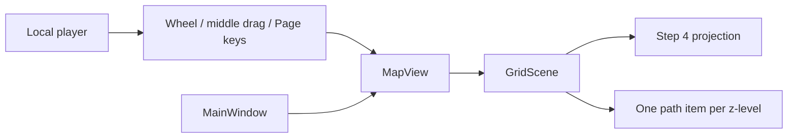
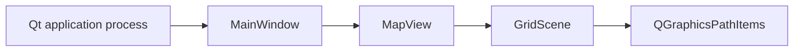

# v0.1 Step 11: MapView and GridScene — Specification (Standard)

## Revision History

| Version | Date | Author | Change |
| --- | --- | --- | --- |
| 0.1 | 2026-07-26 | Codex | Initial Step 11 contract derived from the master specification, canonical design, operational Qt notes, current projection/window implementation, and Qt for Python documentation. |
| 0.2 | 2026-07-26 | Codex | Resolve all ten max-effort Codex review findings: bind scene lifetime, satisfiable zoom semantics, master performance budgets, normative workflows, exact input contracts, integration-test placement, synchronized design notes, provisional contrast, durable links, and domain ownership. |
| 0.3 | 2026-07-26 | Codex | Promote the max-effort Codex-converged specification to the tracked Project Spec corpus; adjust lifecycle, status, and location-relative links. |

**Spec lifecycle:** This tracked document is `approved` and change-controlled. Changes to scope,
requirements, design, acceptance, or lifecycle metadata require a revision row and owner
re-approval when scope-affecting. Implementation deviations belong in the
[Deviations Log](#deviations-log), not in silent requirement edits.

---

## 1. Purpose & Background

Step 10 proves that the Qt application shell, model bridge, and main-window lifecycle run
together, but the central area is still a placeholder. Step 11 introduces the first real map
surface: an empty isometric sector grid whose camera can zoom and pan and whose active z-level
can change. This is the rendering foundation required before Step 12 adds selectable cells and
the player ship.

The milestone deliberately proves graphics-view mechanics without introducing gameplay input,
model-driven entity items, final theming, or persistence. `GridScene` owns deterministic empty
grid geometry and z-level presentation. `MapView` owns camera interaction and delegates
z-level changes to the scene. `MainWindow` replaces only its central placeholder with the new
view/scene pair; its existing bridge, docks, actions, state indicator, and teardown behavior
remain intact.

## 2. Scope

### 2.1 In Scope

- `view/scene/grid_scene.py` with validated dimensions, one batched empty-grid path per
  z-level, active-level state, opacity updates, and deterministic scene bounds.
- `view/scene/map_view.py` with render hints, cursor-anchored bounded wheel zoom,
  middle-mouse-drag pan, PageUp/PageDown z-level switching, and stable test surfaces.
- `view/scene/__init__.py` re-exports for `GridScene` and `MapView` while preserving the
  existing projection exports.
- `MainWindow` central-widget replacement using a 15×15×7 empty test-sector scene.
- pytest-qt unit/integration coverage for construction, geometry, opacity, bounds, zoom, pan,
  key handling, main-window integration, and regression of Step 10 lifecycle behavior.
- Project Spec, documentation, architecture, type, lint, import-boundary, test, coverage, and
  dependency validation required by the repository.

### 2.2 Out of Scope (Non-Goals — never)

| ID | Non-Goal | Reason |
| --- | --- | --- |
| NG-001 | `MapView` and `GridScene` shall not import or subscribe to `stmrr.model.events` or Blinker. | Model events cross into Qt only through `controller/model_bridge.py`. |
| NG-002 | `GridScene` shall not own model/domain entity state, movement rules, AP, selection decisions, combat rules, or model mutation. | A graphics scene may later contain graphical entity items, but model/controller milestones own game behavior and domain state. |
| NG-003 | Step 11 shall not create a separate combat scene. | ADR-0008 requires sector exploration and combat to share one scene. |
| NG-004 | Camera transforms shall not change world coordinates or projection formulas. | Zoom and pan are view transforms; Step 4 owns world-to-scene geometry. |

### 2.3 Won't Have in v1 (deferred — not never)

| ID | Deferred Capability | Why Deferred | Revisit When |
| --- | --- | --- | --- |
| WH-001 | `GridCellItem`, `StarshipItem`, entity sprites, hover, and selection. | Step 11 proves the empty rendering surface first. | Step 12 begins after this specification's exit criteria pass. |
| WH-002 | Left-click hit testing, movement dispatch, context menus, and arrow-key camera commands. | Controller input routing and gameplay actions are not part of the empty-grid milestone. | The selection or movement/action sub-spec defines the complete input contract. |
| WH-003 | Toolbar zoom/reset and z-level actions. | The existing toolbar remains a disabled placeholder until action wiring is specified. | A later UI action sub-spec connects camera commands. |
| WH-004 | Retro QSS, fonts, QtAwesome icons, final grid palette, and asset loading. | Visual theming is a later v0.1 release-gate slice. | The theme/settings/assets sub-spec begins. |
| WH-005 | Window, camera, zoom, or active-z persistence. | Step 11 owns in-memory rendering behavior only. | The dedicated settings/persistence slice defines restore semantics. |
| WH-006 | Model-driven grid dimensions or scene switching between galaxy and sector modes. | The current shell has no composed campaign or mode-specific world. | Galaxy/sector composition receives its own reviewed sub-spec. |

### 2.4 Boundaries

| Boundary | Description |
| --- | --- |
| System owns | Empty sector-grid graphics paths, active-z presentation, scene rectangle, view transform, mouse camera interaction, z-key delegation, and central-widget composition. |
| System depends on | PySide6, Step 4 projection constants/functions, Step 10 `MainWindow`, Qt offscreen testing, and the dimensions approved by the canonical design. |
| System does not own | Model/domain state, model events or entities, controller actions, final theme, settings persistence, combat overlays, assets, or galaxy-map rendering. |

## 3. Context

### 3.1 Current State

`src/stmrr/view/scene/projection.py` provides tested 64×32 isometric projection with a 32-pixel
z offset and painter-order helper. `MainWindow._build_central()` currently installs a
`QWidget` named `mapViewPlaceholder` containing a “pending Step 11” label. The application
composition, bridge ownership, menus, docks, toolbar, turn bar, and state indicator already
pass the current integration suite.

The canonical design permits sector dimensions from 1×1×1 through 20×20×7. Supplementary
operational notes use 15×15×7 as the v0.1 test-sector size. Qt's current graphics-view
documentation confirms that `QGraphicsView.scale()` applies view transforms,
`AnchorUnderMouse` anchors transformations at the cursor, `QWheelEvent.angleDelta()` supplies
wheel rotation, higher `QGraphicsItem.zValue()` values paint above lower values, and item
opacity composes with ancestor opacity. Qt also documents that a view does not take ownership
of its scene, so `MainWindow` must provide explicit QObject and Python-reference lifetime.

### 3.2 Target State

Launching the existing shell constructs a 15×15×7 `GridScene` and displays it through one
`MapView`. All seven isometric grid levels are present. Level 0 begins active at opacity 1.0;
other levels render at 0.35. The user can wheel-zoom between 0.25× and 4.0×, drag the camera
with the middle mouse button without activating future left-click selection, and use
PageUp/PageDown to move the active level within bounds.

### 3.3 Assumptions

| ID | Assumption | Impact if False |
| --- | --- | --- |
| A-001 | The v0.1 empty test sector is 15×15×7, while the reusable scene must accept the canonical 1–20 x/y and 1–7 z ranges. | The main-window construction values or dimension bounds require an owner-approved spec revision. |
| A-002 | A 1.15 multiplicative zoom step provides adequate wheel control across the approved 0.25×–4.0× range. | The zoom constant may be revised before implementation only with equivalent clamp and test obligations. |
| A-003 | One `QPainterPath`/`QGraphicsPathItem` per z-level is sufficient for at most 2,800 empty-cell diamonds. | Failure of the master NFR-003 input or 30-FPS repaint subset requires representation review before entity items land. |
| A-004 | Active z-level is view-local state until a later model/controller milestone establishes a model-owned navigation command. | Premature model ownership would widen Step 11 and require a new event/input contract. |

### 3.4 Constraints

| ID | Constraint | Source |
| --- | --- | --- |
| C-001 | Rendering uses PySide6 `QGraphicsView`, `QGraphicsScene`, and one Qt event loop. | ADR-0001. |
| C-002 | The model remains Qt-free and the view does not subscribe to model events directly. | ADR-0003 and import-linter. |
| C-003 | Combat will reuse this sector scene rather than introduce a separate scene. | ADR-0008. |
| C-004 | Projection constants and formulas remain owned by `view/scene/projection.py`; Step 11 shall not duplicate isometric math. | SPEC-S004. |
| C-005 | Supported scene dimensions are positive non-bool integers with width/height at most 20 and depth at most 7. | Canonical design §4.3. |
| C-006 | Qt tests run headless through the repository's `QT_QPA_PLATFORM=offscreen` configuration. | Repository convention and pytest configuration. |
| C-007 | Source and tests pass BasedPyright strict and the complete repository verification gate. | Python Tooling 1.8 and `AGENTS.md`. |

## 4. Goals

| ID | Goal | Success Signal | Achieved By |
| --- | --- | --- | --- |
| G-001 | Replace the placeholder with a deterministic empty isometric grid. | Main-window integration shows all configured levels and no placeholder widget. | FR-001 through FR-007 |
| G-002 | Provide bounded, predictable camera navigation. | Wheel and middle-drag behavior pass at normal and boundary states. | FR-008 through FR-014 |
| G-003 | Provide bounded active-z navigation with unambiguous layer emphasis. | PageUp/PageDown and direct scene calls update state and opacity without leaving range. | FR-015 through FR-018 |
| G-004 | Preserve the existing MVC shell and architecture. | Step 10 regression tests and all import contracts remain green. | FR-019 through FR-021, NFR-001 through NFR-005 |

---

> **§5 (Stakeholders and Users) is Full-tier** and is intentionally omitted at the Standard profile.

## 6. Glossary

| Term | Definition | Notes / Not to be confused with |
| --- | --- | --- |
| World coordinate | Integer `(x, y, z)` cell coordinate passed through Step 4 projection. | Not a scene or viewport pixel. |
| Scene coordinate | Floating-point point in `QGraphicsScene` space after isometric projection. | Zoom and pan do not modify it. |
| View transform | `QGraphicsView` camera transform applied while presenting scene coordinates. | It must not be applied to item data. |
| Grid path | One `QPainterPath` containing the diamond outlines for all cells on one z-level. | It is not a selectable `GridCellItem`. |
| Active z-level | The selected in-range layer drawn at opacity 1.0. | All other layers remain visible at 0.35. |
| Zoom factor | The uniform x/y scale represented by the view transform relative to 1.0×. | It is bounded to 0.25–4.0 inclusive. |

## 7. Requirements

Every requirement in §7, §10.2, §10.3, and §12.1 is normative and release-blocking unless its
row explicitly states otherwise. Interface, data, workflow, edge-case, and expected-failure
rows therefore have Must priority even where the Project Spec table shape has no Priority
column.

### 7.1 Functional Requirements

| ID | Requirement | Rationale | Acceptance Criteria | Priority |
| --- | --- | --- | --- | --- |
| FR-001 | `GridScene` shall subclass `QGraphicsScene` and accept `width`, `height`, and `depth` constructor arguments. | One reusable scene must represent variable canonical sector dimensions. | Construction with boundary-valid dimensions exposes the exact values. | Must |
| FR-002 | `GridScene` shall reject each dimension that is a bool, non-int, less than 1, or above its canonical maximum with a field-specific `TypeError` or `ValueError`. | Invalid geometry must fail before partial scene population. | Parametrized tests cover every type, lower, and upper boundary with no constructed partial scene. | Must |
| FR-003 | `GridScene` shall create exactly one `QGraphicsPathItem` for each z-level, with one diamond outline per `(x, y)` cell in that level's `QPainterPath`. | Batched paths keep the empty-grid milestone compact and avoid premature cell-item behavior. | Item count equals depth; path element/geometry checks cover origin, axes, far corner, and every level. | Must |
| FR-004 | `GridScene` shall derive each diamond center and its half-tile vertices from `world_to_scene()`, `TILE_WIDTH`, and `TILE_HEIGHT` without restating the projection formula. | Step 4 remains the single geometry source of truth. | A source/behavior check and exact projected-corner tests detect duplicated or divergent formulas. | Must |
| FR-005 | Each level path shall use one cosmetic 1-pixel `#4A5878` pen and no fill, and the scene shall initialize a `#0A0E1A` background. | The canonical bright-border/deep-background pairing makes the pre-theme grid visible without line-width scaling; Step 14 may replace these provisional literals with palette tokens. | Pen width/color/cosmetic/brush/background tests and a non-empty rendered-image smoke check pass without claiming the Step 14 final theme. | Must |
| FR-006 | `GridScene` shall assign each level path a z-value that increases with world z. | Higher layers must paint above lower layers in the empty-grid stack. | Exact monotonic ordering across all configured levels passes. | Must |
| FR-007 | `GridScene` shall set an explicit padded `sceneRect` derived from the union of all level-item bounds. | Qt's auto-growing scene rect is not deterministic under rebuild/removal and camera pan needs stable bounds. | The rectangle contains every level bound plus at least half a tile of padding on each side. | Must |
| FR-008 | `MapView` shall subclass `QGraphicsView`, accept a `GridScene`, use `AnchorUnderMouse` for transformations and `AnchorViewCenter` for resizing, set `StrongFocus`, retain/reacquire focus for handled camera input, and enable antialiasing plus smooth pixmap transforms. | These settings define the approved map camera, keyboard availability, and render quality. | Construction and interaction tests assert the scene, anchors, exact focus policy/retention, and render-hint flags. | Must |
| FR-009 | `MapView` shall expose a read-only zoom factor derived from its current uniform transform and a `reset_zoom()` operation that restores exactly 1.0× without changing scene data. | Tests and later toolbar actions need a stable camera surface. | Zoom, reset, and scene-coordinate invariance tests pass. | Must |
| FR-010 | `MapView.wheelEvent()` shall use vertical `QWheelEvent.angleDelta()` and factor `1.15 ** (delta_y / 120)` before clamping; positive delta zooms in, negative delta zooms out, handled nonzero events are accepted, and zero-y events defer to Qt's base behavior. | One exact relation supports ordinary and high-resolution deltas without swallowing unrelated scrolling. | Positive, negative, multi-step, fractional-step, and zero-y event tests prove direction and the formula. | Must |
| FR-011 | Wheel zoom shall clamp the resulting zoom factor to the closed range 0.25× through 4.0× without overshoot or transform drift. | The canonical design fixes the usable camera range. | Repeated zoom-in/out and boundary-start tests finish exactly within the range; x/y scales remain equal. | Must |
| FR-012 | When scroll ranges allow compensation, wheel zoom shall preserve the scene point beneath the cursor within one scene pixel; when the complete scene fits an axis, Qt center alignment shall keep the scene centered on that axis instead of claiming impossible cursor anchoring. | Cursor-centered zoom is useful only where scrollbars can offset the transform; fitted content has a defined centered behavior. | Tests cover an enlarged/zoomed scene with available ranges and the default fitted scene, asserting anchor tolerance only on compensable axes and center stability on fitted axes. | Must |
| FR-013 | Middle-button press/move/release shall pan by adjusting view scrollbars, consume the handled gesture, and leave transform scale unchanged: for viewport movement `(dx, dy)`, horizontal and vertical scrollbar values change by `(-dx, -dy)` subject to Qt range clamping. | Content follows the dragged hand while preserving future left-click selection semantics that `ScrollHandDrag` would otherwise claim. | pytest-qt gesture tests at 2.0× prove exact unclamped sign/deltas, clamped boundary behavior, stable zoom, and no stuck pan state. | Must |
| FR-014 | Left and right mouse events shall continue through `QGraphicsView` unchanged in Step 11. | Later selection/context behavior must not be preempted by camera plumbing. | Event-spy regression tests show only middle-button gestures enter pan state. | Must |
| FR-015 | `GridScene` shall expose read-only `active_z`, initialize it to 0, and provide `set_active_z(level)` plus `change_active_z(delta)`. | Z presentation needs one explicit, testable owner. | Construction and direct-method tests cover initial, interior, and boundary states. | Must |
| FR-016 | `set_active_z()` shall reject bool/non-int levels with `TypeError` and levels outside `0 <= level < depth` with `ValueError`, without changing the prior active level. | Direct API misuse must fail atomically. | Parametrized type/range and no-mutation tests pass. | Must |
| FR-017 | `change_active_z()` shall require a non-bool int delta and clamp the result to the valid level range; a boundary change beyond the range is a no-op. | Page keys must never produce an invalid level. | Positive, negative, large-delta, and repeated-boundary tests pass. | Must |
| FR-018 | After construction or an active-level change, exactly the active level path shall have opacity 1.0 and every other level path shall have opacity 0.35. | The player must distinguish the target layer while retaining 3D context. | Every-level transitions assert exact opacity values and no item replacement. | Must |
| FR-019 | `MapView.keyPressEvent()` shall route PageUp to `change_active_z(+1)` and PageDown to `change_active_z(-1)`, accept those keys, and delegate all other keys to the base class. | The canonical z-switch controls must work without capturing unrelated shortcuts. | Focused key tests cover both directions, both bounds, and an unrelated key. | Must |
| FR-020 | `MainWindow` shall replace `mapViewPlaceholder` with one `GridScene(15, 15, 7, parent=self)` retained by a typed strong reference and one central `MapView` named `mapView`, also retained by the window, while preserving every existing non-central widget and bridge lifecycle. | `QGraphicsView` does not own its scene; explicit QObject and Python ownership keeps the map alive and ensures window teardown owns cleanup. | Integration tests delete construction locals and force collection without losing `view.scene()`, then close/delete the window without leaked top-level widgets; all Step 10 chrome, state, bridge, and close behaviors pass. | Must |
| FR-021 | `stmrr.view.scene` shall re-export `GridScene` and `MapView` in addition to the existing projection surface. | Later view modules and tests need one intentional package interface. | Exact import and `__all__` tests pass without removing prior exports. | Must |

### 7.2 Non-Functional Requirements

| ID | Category | Requirement | Measurement / Acceptance Criteria | Priority |
| --- | --- | --- | --- | --- |
| NFR-001 | Architecture | Step 11 shall preserve all five import-linter contracts and add no model-event or Blinker import under `stmrr.view`. | `uv run lint-imports` reports all contracts kept; source inspection finds no prohibited import. | Must |
| NFR-002 | Performance | Step 11 shall qualify the master NFR-003 subset: handled zoom/pan/z input responds within 16 ms and maximum-grid static repaint throughput is at least 30 FPS on the documented project workstation. | A recorded, non-CI acceptance probe names CPU/GPU/display/backend, uses 10 warm-up operations and 100 measured repetitions per handler and repaint case, reports median/p95/max, has every measured handler below 16 ms, and averages at most 33.3 ms per maximum-grid repaint. Startup, sector-load, combat-init, galaxy-render, save/load, turn, AI, animation, and long-session budgets remain owned by later master sub-specs. | Must |
| NFR-003 | Reliability | Repeated zoom, pan, and z-switch operations shall preserve finite uniform transforms, valid active-z state, and the original level-item identities. | A deterministic mixed-operation regression test completes 1,000 operations with all invariants intact. | Must |
| NFR-004 | Testability | All Qt behavior shall be verifiable with pytest-qt under the configured offscreen platform without a real window manager. | Focused Step 11 tests pass with `QT_QPA_PLATFORM=offscreen`; no assertion depends on WM state. | Must |
| NFR-005 | Quality | New and changed files shall pass Ruff, BasedPyright strict, branch-aware coverage, import-linter, and the repository aggregate coverage floor. | `uv run python scripts/check.py` exits 0. | Must |

### 7.3 Interface Requirements

| ID | Interface | Requirement | Contract / Format | Acceptance Criteria |
| --- | --- | --- | --- | --- |
| IR-001 | `GridScene` constructor | The public constructor shall accept three positional-or-keyword integers: `width`, `height`, `depth`. | `GridScene(width: int, height: int, depth: int, parent: QObject \| None = None)`. | Signature/type inspection and construction tests pass. |
| IR-002 | Active-z API | The scene shall expose `active_z`, `set_active_z(level)`, and `change_active_z(delta)`. | Integer world z in `[0, depth)`, with direct-set errors and delta clamping per §7.1. | API and state/opacity tests pass. |
| IR-003 | `MapView` constructor | The view shall accept a `GridScene` plus optional widget parent. | `MapView(scene: GridScene, parent: QWidget \| None = None)`. | Signature/type and scene-identity tests pass. |
| IR-004 | Camera API | The view shall expose `zoom_factor` and `reset_zoom()`. | Uniform finite scale in `[0.25, 4.0]`; reset target `1.0`. | Direct and event-driven camera tests pass. |
| IR-005 | User input | The view shall consume vertical wheel, middle-drag, PageUp, and PageDown according to §7.1. | Qt `QWheelEvent`, `QMouseEvent`, and `QKeyEvent` overrides. | pytest-qt interaction tests pass. |
| IR-006 | Main-window composition | The existing central placeholder shall be replaced without changing the public application-builder signature. | `MainWindow` central widget is `MapView`; private typed references retain the view and parented scene; `build_main_window()` remains unchanged. | Existing app composition plus central-widget, forced-GC lifetime, and close-cleanup tests pass. |

### 7.4 Data Requirements

| ID | Data Entity | Requirement | Validation Rules | Ownership |
| --- | --- | --- | --- | --- |
| DR-001 | Grid dimensions | `GridScene` shall retain immutable-by-convention width, height, and depth values used to build its geometry. | Positive non-bool integers; x/y no greater than 20; depth no greater than 7. | `GridScene` |
| DR-002 | Active z | `GridScene` shall retain one in-memory active level. | Integer in `[0, depth)`; default 0; no persistence in Step 11. | `GridScene` |
| DR-003 | Camera state | `MapView` shall retain only ordinary Qt transform and transient middle-pan state. | Uniform finite zoom clamped to `[0.25, 4.0]`; pan state clears on middle release or `focusOutEvent()`. | `MapView` |
| DR-004 | Level items | `GridScene` shall retain a stable ordered collection mapping every z-level to its path item. | One unique item per level; identities do not change during active-z updates. | `GridScene` |

## 8. Architecture and Design

### 8.1 Architecture Summary

`GridScene` is a Qt-only presentation object. During construction it validates dimensions,
builds one `QPainterPath` for every z-level, and adds each as a `QGraphicsPathItem`. For every
cell it calls the existing Step 4 projection to obtain the center, then uses the shared tile
dimensions to add the four diamond edges. The scene holds stable level-item references,
updates only their opacity for z changes, and fixes its scene rectangle from their union.

`MapView` presents one `GridScene`. Wheel events modify only the view transform. Middle-drag
modifies only scrollbars. Page keys call the scene's bounded active-z operation. No interaction
enters the controller or model in this milestone. `MainWindow` constructs the v0.1 test scene
and installs its view as the central widget, leaving the Step 10 MVC seam untouched.

### 8.2 Architecture Views

#### 8.2.1 Context View



#### 8.2.2 Container / Deployment View



#### 8.2.3 Component View

| Component | Responsibility | Interfaces | Notes |
| --- | --- | --- | --- |
| `GridScene` | Validate dimensions, construct empty grid geometry, own active z and level emphasis, define scene bounds. | Constructor and active-z API. | No entities, model events, or gameplay rules. |
| `MapView` | Present the scene and own camera/z-navigation input. | Qt event overrides plus zoom API. | Middle pan uses scrollbars, preserving left-button semantics. |
| `projection.py` | Convert world cell centers to scene coordinates and supply tile constants. | Existing pure functions/constants. | Unchanged by Step 11. |
| `MainWindow` | Compose one v0.1 scene/view into the existing shell. | Existing constructor and app builder. | Existing bridge binding and close teardown remain unchanged. |

### 8.3 Design Decisions

| ID | Decision | Rationale | Alternatives Considered | ADR |
| --- | --- | --- | --- | --- |
| D-001 | Represent each z-level as one batched path item. | It renders the empty grid with seven items maximum and does not preempt Step 12 cell-item semantics. | One item per cell would create up to 2,800 premature interactive items; one path for all levels would prevent per-level opacity. | ADR-0001 |
| D-002 | Keep isometric coordinates in item geometry and reserve the view transform for camera zoom/pan. | Step 4 already owns projection; applying another isometric transform would double-transform geometry. | A scene/view isometric `QTransform` conflicts with the implemented projection contract. | ADR-0001 |
| D-003 | Implement middle pan by explicit scrollbar deltas. | Qt's `ScrollHandDrag` is oriented around ordinary hand-drag/left-button interaction and would collide with Step 12 selection semantics. | Synthetic left-button events are fragile; permanent `ScrollHandDrag` captures the wrong button. | ADR-0001 |
| D-004 | Keep active z in `GridScene` for Step 11. | The milestone has no model-owned navigation command, and opacity is presentation state. | Adding model events/controller commands now would expand scope before interaction rules exist. | ADR-0003 |
| D-005 | Use an explicit scene rectangle based on current item bounds. | Qt's automatic scene rect grows but does not provide deterministic shrink/rebuild behavior. | Relying on implicit bounds complicates later scene reuse and tests. | ADR-0001 |
| D-006 | Reuse one sector scene for future combat mode. | Entity position and camera continuity are product requirements. | A combat-specific scene is prohibited. | ADR-0008 |

> **§8.4 (Solution Alternatives Considered) is Full-tier** and is intentionally omitted at the Standard profile.

### 8.5 Design Constraints

- `GridScene` uses Step 4 projection and constants; it does not duplicate the forward formula.
- `MapView` does not apply an isometric `QTransform`; only uniform camera scale and scroll
  position may change.
- No view module subscribes to Blinker or imports `stmrr.model.events`.
- Active-z updates change level opacity only; they do not rebuild paths or replace items.
- Step 11 does not enable existing gameplay actions or add controller action handlers.
- No test may rely on a real window manager, physical mouse wheel, timing sleep, or pixel color
  from platform-native widget chrome.

> **§8.6 (Dependency Policy) is Full-tier** and is intentionally omitted at the Standard profile.

## 9. Data Model

Step 11 owns no persistent data. Its complete in-memory state is:

| Object | Fields | Invariants |
| --- | --- | --- |
| `GridScene` | `width`, `height`, `depth`, `active_z`, ordered level items. | Dimensions in canonical bounds; active z in range; one stable item per level. |
| `MapView` | Qt transform, horizontal/vertical scrollbar positions, transient pan flag and last viewport position. | Uniform finite zoom in range; pan flag clears on middle release. |

No schema, migration, save, retention, backup, or cross-process compatibility obligation is
introduced. Later persistence must treat Step 11 camera/z state as a separately approved
decision rather than inferring durability from these fields.

## 10. Behavior and Workflows

### 10.1 Primary Workflow

```mermaid
sequenceDiagram
    actor Player
    participant View as MapView
    participant Scene as GridScene
    participant Items as Level path items

    Player->>View: PageUp
    View->>Scene: change_active_z(+1)
    Scene->>Items: active opacity 1.0, others 0.35
    Items-->>Player: Updated layer emphasis
    Player->>View: Wheel or middle drag
    View->>View: Update transform or scrollbars
    View-->>Player: Camera changes; scene geometry unchanged
```

Steps:

1. `MainWindow` constructs `GridScene(15, 15, 7)` and `MapView`.
2. The scene creates all seven grid paths and emphasizes z=0.
3. The player changes camera scale or scroll position without changing scene geometry.
4. The player changes active z; the scene clamps delta-based navigation and updates opacity.

Expected result:

> The empty grid remains valid and visible throughout camera and z-level interaction, and the
> existing shell remains operational.

### 10.2 Alternate Workflows

| ID | Trigger | Behavior | Expected Result |
| --- | --- | --- | --- |
| AW-001 | Wheel input would exceed a zoom boundary. | Apply only the factor needed to land on the nearest boundary. | Zoom equals 0.25× or 4.0× without overshoot. |
| AW-002 | PageUp/PageDown is pressed at the corresponding z boundary. | Accept the key and retain the current active level/items. | No invalid level, rebuild, or opacity drift occurs. |
| AW-003 | A non-camera key or non-middle mouse event arrives. | Delegate to `QGraphicsView`. | Qt and later handlers retain default event semantics. |
| AW-004 | `reset_zoom()` is called after arbitrary valid camera interaction. | Replace only the view scale with 1.0×. | Scene items, active z, and scrollbar-derived scene data remain unchanged. |

### 10.3 Edge Cases

| ID | Edge Case | Expected Behavior |
| --- | --- | --- |
| EC-001 | Scene dimensions are the minimum 1×1×1. | One one-cell path renders at z=0 and is active. |
| EC-002 | Scene dimensions are the maximum 20×20×7. | Seven paths containing 2,800 cell diamonds construct and meet the NFR-002 repaint-throughput probe. |
| EC-003 | Wheel delta is smaller or larger than one conventional 120-unit step. | Zoom changes proportionally and remains clamped. |
| EC-004 | Middle press begins where scrollbars currently have no range. | The gesture is handled safely; positions remain unchanged and pan state clears. |
| EC-005 | `focusOutEvent()` arrives during a middle-pan gesture before release. | The override clears transient pan state without changing zoom, then delegates the event to `QGraphicsView`. |
| EC-006 | Direct active-z assignment receives invalid input. | A field-specific exception is raised and prior state/opacity remains unchanged. |

### 10.4 State Transitions

| State | Meaning | Entry Condition | Exit Condition |
| --- | --- | --- | --- |
| Idle camera | No middle-pan gesture is active. | Construction or middle release/cancel. | Valid middle press. |
| Panning | Middle movement updates scrollbars by the negated viewport delta. | Middle press accepted. | Middle release or `focusOutEvent()`. |
| Active z=N | Level N is fully opaque and all other levels are 0.35. | Construction, direct set, or clamped delta change. | A valid change selects another level. |

## 11. UI Pages / API Endpoints

| Page or Endpoint | Purpose | Key Actions | Authorization |
| --- | --- | --- | --- |
| Main-window central map | Present the empty v0.1 test-sector grid. | Receive focus; display camera and z-level changes. | Local desktop user. |
| `MapView` camera | Navigate the presented scene. | Wheel zoom, middle-drag pan, reset through API. | Local desktop user or later toolbar action. |
| `GridScene` z presentation | Select which visible grid layer is active. | PageUp/PageDown or direct scene API. | Local desktop user or later controller/UI action. |

The milestone adds no text input, dialog, API, network surface, localization requirement, or
final accessibility claim. It preserves keyboard z navigation and does not capture unrelated
keys or left/right mouse actions.

## 12. Error Handling and Recovery

### 12.1 Expected Failures

| ID | Failure Mode | User/System Behavior | Logging / Observability | Recovery |
| --- | --- | --- | --- | --- |
| ERR-001 | A scene dimension has the wrong type. | Construction raises `TypeError` naming the dimension; no scene is returned. | Focused test observes type/message and no partial object. | Correct the caller. |
| ERR-002 | A scene dimension is outside canonical bounds. | Construction raises `ValueError` naming the dimension and allowed range. | Focused test observes range/message. | Correct the caller or revise the governing design. |
| ERR-003 | Direct active-z input has wrong type or range. | The method raises without changing active level or opacity. | State-preservation test observes the failure. | Supply a valid level. |
| ERR-004 | A middle-pan gesture is interrupted by `focusOutEvent()`. | Transient pan state clears, the base focus-out behavior runs, and scene/zoom remain valid. | Focus-out regression test passes. | Refocus the view and start a new gesture. |
| ERR-005 | Grid construction or rendering raises unexpectedly. | Main-window construction fails visibly rather than showing an incomplete map. | Existing application error/exit behavior exposes the exception during tests or startup. | Repair the defect and run the prior verified revision meanwhile. |

### 12.2 Retry and Idempotency

Construction is not retried. `set_active_z()` with the current level, a boundary-clamped
`change_active_z()`, and `reset_zoom()` at 1.0× are idempotent. Wheel and pan gestures are
deliberately cumulative. A failed direct active-z call is atomic and may be retried with valid
input.

### 12.3 Rollback / Recovery

Step 11 persists no state. Recovery from a regression is process restart and source rollback
to the prior verified Step 10 revision. Construction validates before installing items into the
scene, and active-z validation completes before any opacity update, preventing partial
in-memory presentation changes.

## 13. Security and Privacy

### 13.1 Authentication

Step 11 is a local graphics surface with no identity boundary.

### 13.2 Authorization

| Actor / Role | Allowed Actions | Denied Actions |
| --- | --- | --- |
| Local desktop user | View and navigate the empty grid. | No gameplay mutation, privileged action, remote action, or persistence is exposed. |

### 13.3 Secrets

Step 11 reads no credentials or secret references.

### 13.4 Sensitive Data

Step 11 displays generated empty geometry and retains no player data.

### 13.5 Threats and Mitigations

| Threat | Impact | Mitigation |
| --- | --- | --- |
| View subscribes directly to model events. | The single MVC seam erodes. | Import-linter and explicit no-event-import requirement. |
| Unbounded dimension or zoom input causes excessive graphics work or unusable transforms. | UI stalls or camera becomes unrecoverable. | Canonical dimension limits, zoom clamp, and the documented maximum-size repaint probe. |
| Middle-pan captures future left-click behavior. | Step 12 selection becomes unreliable. | Handle only middle-button gestures and delegate other buttons. |

### 13.6 Hardening Checklist

- [x] N/A — no cookies, sessions, HTTP origins, webhooks, network bindings, or identity headers.
- [x] N/A — no secrets or sensitive data are handled.
- [x] N/A — no privileged filesystem or process operation occurs.
- [ ] Dimension bounds, transform invariants, and architecture contracts pass their tests.

---

> **Sections §14 (Capacity and Scale Assumptions), §15 (Risks), and §16 (Compliance, Licensing, and Data Rights) are Full-tier** and are intentionally omitted at the Standard profile.

## 17. Testing and Acceptance

### 17.1 Definition of Done

- [ ] Every normative requirement in §§7, 10.2, 10.3, and 12.1 is implemented and mapped to
  passing evidence.
- [ ] Minimum, default, and maximum scenes construct with the required paths, bounds, z-order,
  and opacity.
- [ ] Zoom, reset, cursor anchoring, clamping, middle-pan, cancellation, and key delegation
  pass under offscreen pytest-qt.
- [ ] `MainWindow` uses the new central map and all Step 10 behavior remains passing.
- [ ] The documented NFR-002 handler-latency and maximum-grid repaint probes pass on the
  project workstation.
- [ ] Project Spec validate/lint, Markdown checks, handoff checks, and the full Python gate pass.
- [ ] No entity item, gameplay input, theme, persistence, or separate combat scene enters the
  implementation.
- [ ] Deviations are owner-reviewed and no blocking question or defect remains.

### 17.2 Test Strategy

| Layer | Scope | Required Coverage | Required? |
| --- | --- | --- | --- |
| Unit / domain | Existing Qt-free projection helpers only. | Existing projection regression; no new Qt object is classified as a unit test. | Yes |
| Integration / adapter | `GridScene`, `MapView`, `MainWindow`, and Qt events. | Construction, grid geometry, camera, z state, event delegation, lifecycle. | Yes |
| Snapshot / contract | Scene render to `QImage` and stable object/package surfaces. | Non-empty render at minimum/default/maximum; exports and object names. | Yes |
| Database | No datastore. | Not applicable. | No |
| End-to-end | Runnable shell central map. | Build/show/close plus zoom/pan/z interaction under offscreen and a manual desktop smoke. | Yes |
| Security | Architecture boundary and bounded input. | Import-linter plus negative dimensions/zoom/state tests. | Yes |
| Operations | Headless execution and performance probe. | Offscreen full gate plus documented non-CI workstation latency/repaint measurement. | Yes |
| Regression | Step 4 projection and Step 10 shell/bridge behavior. | Existing suites plus focused central-widget amendments. | Yes |

### 17.3 Requirement-to-Test Traceability

| Requirement ID | Test / Verification Method | Status |
| --- | --- | --- |
| FR-001, FR-002, IR-001, DR-001 | `tests/integration/view/scene/test_grid_scene.py` constructor and dimension matrix under pytest-qt. | Not Started |
| FR-003, FR-004, FR-005, FR-006, FR-007, DR-004 | Grid path, projection, pen, z-order, identity, bounds, and rendered-image tests. | Not Started |
| FR-008, IR-003 | `tests/integration/view/scene/test_map_view.py` construction, focus, and render-setting tests. | Not Started |
| FR-009, FR-010, FR-011, FR-012, IR-004 | Zoom/reset/clamp/cursor-anchor event tests. | Not Started |
| FR-013, FR-014, DR-003 | Middle-pan, cancellation, button-delegation, and invariant tests. | Not Started |
| FR-015, FR-016, FR-017, FR-018, IR-002, DR-002 | Active-z API, validation, clamp, opacity, and stable-item tests. | Not Started |
| FR-019, IR-005 | Page key and unrelated-key delegation tests. | Not Started |
| FR-020, IR-006 | Amended `tests/integration/view/test_main_window.py` lifetime/cleanup tests plus existing Step 10 integration/app suites. | Not Started |
| FR-021 | `stmrr.view.scene` import and exact `__all__` regression test. | Not Started |
| NFR-001 | `uv run lint-imports` and prohibited-import source check. | Not Started |
| NFR-002 | Recorded 10-warm-up/100-repetition handler-latency and maximum-grid `QImage` repaint probe with environment/statistics. | Not Started |
| NFR-003 | Seeded 1,000-operation mixed camera/z invariant test. | Not Started |
| NFR-004 | Focused pytest-qt suite under repository offscreen configuration. | Not Started |
| NFR-005 | `uv run python scripts/check.py`. | Not Started |
| AW-001, AW-002, AW-003, AW-004 | Zoom-bound, z-bound, base-delegation, and reset behavior tests in the integration scene/view suites. | Not Started |
| EC-001, EC-002, EC-003, EC-004, EC-005, EC-006 | Minimum/maximum geometry, delta formula, no-scroll pan, exact focus-out cancellation, and invalid-z tests. | Not Started |
| ERR-001, ERR-002, ERR-003, ERR-004, ERR-005 | Constructor/direct-set atomicity, focus-out recovery, and visible main-window construction-failure tests. | Not Started |

## 18. Deployment and Operations

### 18.1 Runtime Environment

| Item | Value |
| --- | --- |
| Runtime | Python 3.14+ with PySide6 |
| OS / Platform | Linux desktop; offscreen Linux for automated tests |
| Datastore | None |
| External services | None |
| Scheduling | Qt event loop |
| Hosting | Local desktop process |

Runtime service:

| Service | Purpose | Start Mode | Health Signal |
| --- | --- | --- | --- |
| `stmrr` desktop process | Display the shell and empty grid. | `uv run python -m stmrr` during development. | Main window shows a navigable grid and closes cleanly. |

### 18.2 Configuration

| Setting | Required? | Default | Description |
| --- | --- | --- | --- |
| `QT_QPA_PLATFORM` | Test-only | `offscreen` under pytest | Headless Qt platform. |
| Main-window grid width | Runtime constant for Step 11 | 15 | Empty v0.1 test-sector x dimension. |
| Main-window grid height | Runtime constant for Step 11 | 15 | Empty v0.1 test-sector y dimension. |
| Main-window grid depth | Runtime constant for Step 11 | 7 | Empty v0.1 test-sector z-level count. |
| Zoom bounds | No | 0.25×–4.0× | Closed camera scale interval. |
| Zoom step | No | 1.15 per 120 angle units | Multiplicative wheel scale. |

Environment matrix:

| Aspect | Development | Test | Release |
| --- | --- | --- | --- |
| Display | Linux desktop | Qt offscreen | Not packaged in Step 11 |
| Grid | 15×15×7 via `MainWindow` | Boundary and default fixtures | Same source behavior |
| Input | Physical mouse/keyboard | Synthetic Qt events | Same Qt event handlers |

### 18.3 Deployment Flow

1. Land scene/view modules, package exports, main-window composition, and tests coherently.
2. Run focused offscreen Step 11 tests and render/performance probes.
3. Run Project Spec, Markdown, handoff, and full Python repository gates.
4. Launch `uv run python -m stmrr` on a desktop and manually verify visible grid, wheel zoom,
   middle pan after zooming, PageUp/PageDown emphasis, and clean close.
5. Roll back to the prior verified revision if construction or shell regression appears.

> **§18.4 (Rollout Controls) is Full-tier** and is intentionally omitted at the Standard profile.

### 18.5 Observability

Step 11 adds no metrics or remote alerts. Test assertions observe dimension errors, item
geometry, scene bounds, transform values, scrollbar changes, active level, opacity, render
output, and process behavior. Unexpected startup/render exceptions remain visible through the
existing test/process error surface.

### 18.6 Backup and Disaster Recovery

Step 11 owns no durable data and does not alter existing save or configuration files, so it
requires no backup or disaster-recovery mechanism.

### 18.7 Documentation Deliverables

- [ ] Add Step 11 and the master specification to `docs/handoff/specs-plans.md`.
- [ ] Update `docs/STATUS.md`, `docs/TODO.md`, handoff state, architecture map, and session log
  when implementation status changes.
- [ ] Keep canonical design and supplementary Qt notes consistent with ADR-0008 and this
  reviewed projection/camera contract.
- [ ] Record any approved implementation deviation in this specification.

## 19. Implementation Plan

This is milestone-depth sequencing only; a detailed test-first plan is a separate future
artifact and is out of scope for the current specification-authoring task.

### MS-0 — Scene Contract

1. Add dimension-validation and grid-geometry tests.
2. Implement `GridScene` with stable per-level paths, bounds, active-z state, and opacity.
3. Prove minimum/default/maximum geometry and rendering.

### MS-1 — View Interaction

1. Add camera and z-key behavior tests.
2. Implement bounded cursor-anchored zoom, reset, middle pan/cancel, and key delegation.
3. Prove mixed-operation invariants and offscreen behavior.

### MS-2 — Shell Integration and Acceptance

1. Replace the main-window placeholder and preserve Step 10 behavior.
2. Re-export the public scene surface and update documentation.
3. Run performance, manual desktop smoke, and complete repository gates.

### Milestone Summary

| Milestone | Deliverable | Exit Criteria |
| --- | --- | --- |
| MS-0 | Deterministic empty `GridScene` | All geometry, z-state, bounds, render, and maximum-size checks pass |
| MS-1 | Navigable `MapView` | Zoom, pan, cancel, key, and invariant checks pass offscreen |
| MS-2 | Integrated Step 11 slice | Shell regression, docs, performance, manual smoke, and full gates pass |

---

> **§20 (Success Evaluation) is Full-tier** and is intentionally omitted at the Standard profile.

## 21. Open Questions and Decisions

No blocking question remains. Step 11 uses the provisional canonical-design pairing in FR-005
only to make the empty grid observable. Step 14 owns palette tokens and may replace those
literals without changing Step 11 geometry or camera behavior.

## Deviations Log

No implementation deviation has been recorded.

## References

### Standards

- [Project Specification Standard 1.4](https://github.com/L3DigitalNet/project-standards/tree/v5.8.0/standards/project-spec/versions/1.4)
- [Python Coding 0.6](https://github.com/L3DigitalNet/project-standards/blob/v5.8.0/standards/python-coding/versions/0.6/README.md)

### Project References

- [`star-trek-retro-remake-v1.0-master.md`](star-trek-retro-remake-v1.0-master.md) — approved release-wide scope and milestone decomposition.
- [`docs/design/DESIGN.md`](../design/DESIGN.md) §§4.3, 6, 9.1, and 10.1.
- [`docs/design/tech-stack-pyside6.md`](../design/tech-stack-pyside6.md) §§3 and 11.
- [`docs/specs/v0.1-step-4-projection.md`](v0.1-step-4-projection.md) — implemented projection contract.
- [`docs/specs/v0.1-step-10-main-window.md`](v0.1-step-10-main-window.md) — current shell and lifecycle contract.
- [`docs/adr/0001-pure-qt-rendering.md`](../adr/0001-pure-qt-rendering.md).
- [`docs/adr/0003-model-qt-free.md`](../adr/0003-model-qt-free.md).
- [`docs/adr/0008-combat-on-sector-grid.md`](../adr/0008-combat-on-sector-grid.md).
- [Qt for Python: `QGraphicsView`](https://doc.qt.io/qtforpython-6/PySide6/QtWidgets/QGraphicsView.html).
- [Qt for Python: `QGraphicsScene`](https://doc.qt.io/qtforpython-6/PySide6/QtWidgets/QGraphicsScene.html).
- [Qt for Python: `QGraphicsItem`](https://doc.qt.io/qtforpython-6/PySide6/QtWidgets/QGraphicsItem.html).
- [Qt for Python: `QWheelEvent`](https://doc.qt.io/qtforpython-6/PySide6/QtGui/QWheelEvent.html).

## Appendix A: ID Conventions

| Prefix | Meaning | Defined In |
| --- | --- | --- |
| `G-` | Goal | §4 |
| `NG-` | Non-goal (never) | §2.2 |
| `WH-` | Won't have in v1 (deferred) | §2.3 |
| `A-` | Assumption | §3.3 |
| `C-` | Constraint | §3.4 |
| `FR-` | Functional requirement | §7.1 |
| `NFR-` | Non-functional requirement | §7.2 |
| `IR-` | Interface requirement | §7.3 |
| `DR-` | Data requirement | §7.4 |
| `D-` | Design decision | §8.3 |
| `AW-` | Alternate workflow | §10.2 |
| `EC-` | Edge case | §10.3 |
| `ERR-` | Error-handling requirement | §12.1 |
| `MS-` | Milestone | §19 |
| `OQ-` | Open question | §21 |
| `DEV-` | Deviation | Deviations Log |

Priority values (`Must`, `Should`, `Could`) are column values, not ID prefixes. IDs remain
stable when status or priority changes.

## Appendix B: Agent Implementation Contract

### B.1 Implementation Rules

The implementer shall:

- Read this specification and master `SPEC-MSTR` before changes.
- Re-read §7, §21, and the Deviations Log in later sessions.
- Preserve non-goals, deferrals, constraints, ADRs, and the Step 10 lifecycle.
- Treat Must requirements and blocking questions as hard gates.
- Record non-blocking ambiguity as an `OQ-` with a proposed assumption.
- Record every divergence as a `DEV-` rather than adapting silently.
- Add behavior-focused tests first and keep §17.3 current.
- Complete MS-0 through MS-2 in order; do not begin Step 12 work.
- Update repository handoff and specification pointers at closeout.

### B.2 Prohibited Behaviors

The implementer shall not:

- Add entity items, selection, movement, gameplay actions, final theming, or persistence.
- Duplicate projection formulas or apply a second isometric transform.
- Import model events or Blinker into the view.
- Add a separate combat scene.
- Weaken checks, exclusions, typing, coverage, or import contracts.
- Add dependencies.
- Mark a requirement complete without passing evidence in §17.3.

### B.3 Required Completion Report (verification gate)

At completion, provide:

- Summary and files changed.
- Every implemented Must requirement mapped to a passing test or command.
- Tests added or changed.
- Performance and manual desktop-smoke evidence.
- Deviations and owner disposition.
- Known limitations and open questions.
- Documentation/handoff updates.
- Commit, branch, push/parity, and worktree state.

### B.4 Session Handoff

Record current milestone, in-progress requirement IDs, and unresolved `OQ-`/`DEV-` items in
the repository handoff documents. This specification defines the Step 11 contract; handoff
records implementation state.

---

> **Appendix C (Optional Modules) is Full-tier** — external-integration, scheduling, entity-resolution, and scoring modules — and is intentionally omitted at the Standard profile.

## Appendix D: Tailoring

The Standard profile is selected because Step 11 is a typical in-process UI subsystem with no
external service or durable data. Security and operations sections are retained in tailored
form because architecture boundaries, dimension limits, headless execution, and rendering
acceptance are material. Full-tier sections would add no decision-relevant content.
